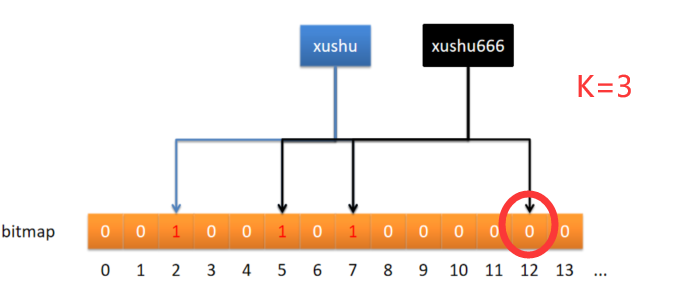
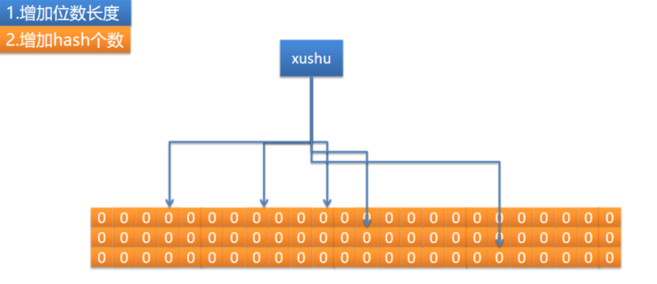

大家也知道， 现在八股文问的不多了， 有小伙伴去阿里面试被问到这样一个开放性面试题：**如何管理昵称重复**

他说直接通过数据库判断不就行了吗？ 重复就提示，  这个逻辑没问题， 那如果是高并发场景呢？你这样回答肯定就不行哈

哈喽大家好， 我是徐庶，需要更多开放性场具面试题的小伙伴可以在评论区扣666，我已经总结在了我80万字面试资料中。 

来讲下高并发下的用户注册**昵称重复问题。**

****

其实我们完全可以通过使用**布隆过滤器**：

布隆过滤器的好处是它可以用来判断一个元素是否在一个集合中。它的优势是只需要占用很小的内存空间以及有着高效的查询效率。 的本质其实就是个bit位数组： 数组的每个元素都只占用 1 bit ，并且每个元素只能是 0 或者 1。

关于布隆过滤器更多的详细点我不做太多介绍，  可以看我往期视频，之前有详细精讲介绍。

说回我们的场景：  用户新增昵称时需要首先计算K个哈希值，

如果K个哈希值有一个不为0呢，代表昵称不存在，否则代表昵称已存在。

对于 BloomFilter 判断不存在的 key ，就一定是 100% 不存在，反之，如果这个 key 存在， 也可能是极小概率的误判，

这也就是布隆过滤器 “不存在一定不存在,存在不一定存在”  的理论。  

当然也可以通过增加K个哈希个数， 或者增加bit位数组长度减少误判率。

那在用户昵称存在情况下，我们还可以这样来处理，在昵称后面追加随机字符串或数字再次检验，检测通过后返回给前端，帮助用户自动填写昵称， 这就是我们经常在注册时看到昵称存在会有一些昵称建议填写。 

好如果视频对你有帮助给我一个三连支持， 我们下期见！

