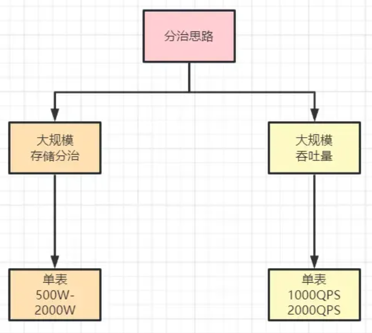
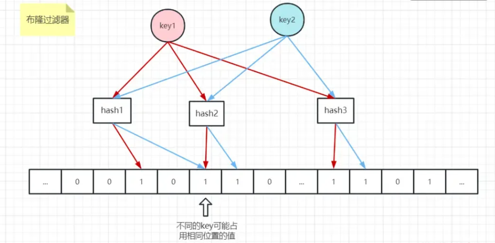

:::info
<font style="color:rgb(23, 35, 63);">这道场景设计题，看上去业务简单，其实，覆盖的知识点非常多：</font>

+ <font style="color:rgb(51, 51, 51);">高并发、高性能分布式 ID</font>
+ <font style="color:rgb(51, 51, 51);">Redis Bloom Filter 高并发、低内存损耗的 过滤组件知识</font>
+ <font style="color:rgb(51, 51, 51);">分库、分表海量数据存储</font>
+ <font style="color:rgb(51, 51, 51);">多级缓存的知识</font>
+ <font style="color:rgb(51, 51, 51);">HTTP传输知识</font>
+ <font style="color:rgb(51, 51, 51);">二进制、十六进制、六十二进制知识</font>

<font style="color:rgb(23, 35, 63);">总体来说，高并发、高性能系统的核心领域，都覆盖了。所以，分析下来，得到一个结论：是一个超级好的问题。</font>

:::

## <font style="color:rgb(34, 34, 34);">1、短URL系统的背景</font>
<font style="color:rgb(23, 35, 63);">短网址替代长URL，在互联网网上传播和引用。</font>

<font style="color:rgb(23, 35, 63);">例如QQ微博的url.cn，新郎的sinaurl.cn等。</font>

<font style="color:rgb(23, 35, 63);">在QQ、微博上发布网址的时候，会自动判别网址，并将其转换，例如：</font>[url.cn/2hytQx](http://xn--url-4m0aa.cn/2hytQx%E2%80%8B%E2%80%8B)

<font style="color:rgb(23, 35, 63);">为什么要这样做的，无外乎几点：</font>

1. <font style="color:rgb(51, 51, 51);">缩短地址长度，留足更多空间的给 有意义的内容  
</font><font style="color:rgb(51, 51, 51);">URL是没有意义的，有的原始URL很长，占用有效的屏幕空间。  
</font><font style="color:rgb(51, 51, 51);">微博限制字数为140字一条，那么如果这个连接非常的长，以至于将近要占用我们内容的一半篇幅，这肯定是不能被允许的，链接变短，对于有长度限制的平台发文，可编辑的文字就变多了， 所以短网址应运而生了。</font>
2. <font style="color:rgb(51, 51, 51);">可以很好的对原始URL内容管控。  
</font><font style="color:rgb(51, 51, 51);">有一部分网址可以会涵盖XX，暴力，广告等信息，这样我们可以通过用户的举报，完全管理这个连接将不出现在我们的应用中，应为同样的URL通过加密算法之后，得到的地址是一样的。</font>
3. <font style="color:rgb(51, 51, 51);">可以很好的对原始URL进行行为分析  
</font><font style="color:rgb(51, 51, 51);">我们可以对一系列的网址进行流量，点击等统计，挖掘出大多数用户的关注点，这样有利于我们对项目的后续工作更好的作出决策。</font>
4. <font style="color:rgb(51, 51, 51);">短网址和短ID相当于间接提高了带宽的利用率、节约成本</font>
5. <font style="color:rgb(51, 51, 51);">链接太长在有些平台上无法自动识别为超链接</font>
6. <font style="color:rgb(51, 51, 51);">短链接更加简洁好看且安全，不暴露访问参数。而且，能规避关键词、域名屏蔽等手段</font>

## <font style="color:rgb(34, 34, 34);">2、短URL系统的原理</font>
<font style="color:rgb(23, 35, 63);">短URL系统的核心：</font>**<font style="color:rgb(23, 35, 63);">将长的 URL 转化成短的 URL</font>**<font style="color:rgb(23, 35, 63);">。</font>

<font style="color:rgb(23, 35, 63);">客户端在访问系统时，短URL的工作流程如下：</font>

+ <font style="color:rgb(51, 51, 51);">先使用短地址A访问 短链Java 服务</font>
+ <font style="color:rgb(51, 51, 51);">短链Java 服务 进行 地址转换和映射，将 短URL系统映射到对应的长地址URL</font>
+ <font style="color:rgb(51, 51, 51);">短链Java 服务 返回302 重定向 给客户端</font>
+ <font style="color:rgb(51, 51, 51);">然后客户端再重定向到原始服务</font>

<font style="color:rgb(23, 35, 63);">如下图所示：</font>


<font style="color:rgb(23, 35, 63);">那么，原始URL如何变短呢？简单来说， 可以将原始的地址，使用编号进行替代</font>

<font style="color:rgb(23, 35, 63);">编号如何进一步变短呢？ 可以使用更大的进制来表示</font>

### <font style="color:rgb(34, 34, 34);">六十二进制表示法</font>
<font style="color:rgb(23, 35, 63);">顾名思义短网址就是非常短的网址，比如xxx.cn/EYyCO9T，其中核… EYyCO9T 只有7位长度。</font>

<font style="color:rgb(23, 35, 63);">其实这里的7位长度是使用62进制来表示的，就是常用的0-9、a-z、A-Z，也就是10个数字+26个小写+26个大写=62位。</font>

<font style="color:rgb(23, 35, 63);">那么7位长度62进制可以表示多大范围呢?</font>

```plain
62^7 = 3,521,614,606,208 (合计3.5万亿)，

说明：

10进制 最大只能生成 10 ^ 6 - 1 =999999个
16进制 最大只能生成 16 ^ 6 - 1 =16777215个
16进制里面已经包含了 A B C D E F 这几个字母
62进制 最大竟能生成 62 ^ 6 - 1 =56800235583个 基本上够了。
A-Z a-z 0-9 刚好等于62位

注意：

int(4个字节) ，存储的范围是-21亿到21亿
long(8个字节)，存储的范围是-900万万亿 到 900万万亿
```

<font style="color:rgb(23, 35, 63);">至于短网址的长度，可以根据自己需要来调整，如果需要更多，可以增加位数，</font>

<font style="color:rgb(23, 35, 63);">即使6位长度62^6也能达到568亿的范围，</font>

<font style="color:rgb(23, 35, 63);">这样的话只要算法得当，可以覆盖很大的数据范围。</font>

<font style="color:rgb(23, 35, 63);">在编码的过程中，可以按照自己的需求来调整62进制各位代表的含义。</font>

<font style="color:rgb(23, 35, 63);">一个典型的场景是， 在编码的过程中，如果不想让人明确知道转换前是什么，可以进行弱加密，</font>

<font style="color:rgb(23, 35, 63);">比如A站点将字母c表示32、B站点将字母c表示60，就相当于密码本了。</font>

### <font style="color:rgb(34, 34, 34);">128进制表示法</font>
<font style="color:rgb(23, 35, 63);">标准ASCII 码也叫基础ASCII码，使用7 位二进制数（剩下的1位二进制为0）,包含128个字符，</font>

<font style="color:rgb(23, 35, 63);">看到这里你或许会说，使用128进制(如果有的话)岂不是网址更短，</font>

<font style="color:rgb(23, 35, 63);">是的，</font>

<font style="color:rgb(23, 35, 63);">7 位二进制数（剩下的1位二进制为0）表示所有的大写和小写字母，数字0 到9、标点符号，以及在美式英语中使用的特殊控制字符 [1] 。</font>

```plain
注意：

128个进制就可能会出现大量的不常用字符

比如 # % & * 这些，

这样的话，对于短链接而言，通用性和记忆性就变差了，

所以，62进制是个权衡折中。
```

## <font style="color:rgb(34, 34, 34);">3、短 URL 系统的功能分析</font>
<font style="color:rgb(23, 35, 63);">假设短地址长度为8位，62的8次方足够一般系统使用了</font>

### <font style="color:rgb(34, 34, 34);">系统核心实现，包含三个大的功能</font>
+ <font style="color:rgb(51, 51, 51);">发号</font>
+ <font style="color:rgb(51, 51, 51);">存储</font>
+ <font style="color:rgb(51, 51, 51);">映射</font>

<font style="color:rgb(23, 35, 63);">可以分为两个模块：发号与存储模块、映射模块</font>

### <font style="color:rgb(34, 34, 34);">发号与存储模块</font>
+ <font style="color:rgb(51, 51, 51);">发号：使用发号器发号 ， 为每个长地址分配一个号码ID，并且需要防止地址二义，也就是防止同一个长址多次请求得到的短址不一样</font>
+ <font style="color:rgb(51, 51, 51);">存储：将号码与长地址存放在DB中，将号码转化成62进制，用于表示最终的短地址，并返回给用户</font>

### <font style="color:rgb(34, 34, 34);">映射模块</font>
<font style="color:rgb(23, 35, 63);">用户使用62进制的短地址请求服务 ，</font>

+ <font style="color:rgb(51, 51, 51);">转换：将62进制的数转化成10进制，因为咱们系统内部是long 类型的10进制的数字ID</font>
+ <font style="color:rgb(51, 51, 51);">映射：在DB中寻找对应的长地址</font>
+ <font style="color:rgb(51, 51, 51);">通过302重定向，将用户请求重定向到对应的地址上</font>

## <font style="color:rgb(34, 34, 34);">4、发号器的高并发架构</font>
<font style="color:rgb(23, 35, 63);">回顾一下发号器的功能：</font>

+ <font style="color:rgb(51, 51, 51);">为每个长地址分配一个号码ID</font>
+ <font style="color:rgb(51, 51, 51);">并且需要防止地址歧义</font>

<font style="color:rgb(23, 35, 63);">以下对目前流行的分布式ID方案做简单介绍</font>

### <font style="color:rgb(34, 34, 34);">方案1：使用地址的hash 编码作为ID</font>
<font style="color:rgb(23, 35, 63);">可以通过 原始Url的 hash编码，得到一个 整数，作为 短链的ID</font>

<font style="color:rgb(23, 35, 63);">哈希算法简单来说就是将一个元素映射成另一个元素，</font>

<font style="color:rgb(23, 35, 63);">哈希算法可以简单分类两类，</font>

+ <font style="color:rgb(51, 51, 51);">加密哈希，如MD5，SHA256等，</font>
+ <font style="color:rgb(51, 51, 51);">非加密哈希，如MurMurHash，CRC32，DJB等。</font>

**<font style="color:rgb(23, 35, 63);">MD5算法</font>**

<font style="color:rgb(23, 35, 63);">MD5消息摘要算法（MD5 Message-Digest Algorithm），一种被广泛使用的密码散列函数，</font>

<font style="color:rgb(23, 35, 63);">可以产生出一个128位（16字节）的散列值（hash value），</font>

<font style="color:rgb(23, 35, 63);">MD5算法将数据（如一段文字）运算变为另一固定长度值，是散列算法的基础原理。</font>

<font style="color:rgb(23, 35, 63);">由美国密码学家 Ronald Linn Rivest设计，于1992年公开并在 RFC 1321 中被加以规范。</font>

**<font style="color:rgb(23, 35, 63);">CRC算法</font>**

<font style="color:rgb(23, 35, 63);">循环冗余校验（Cyclic Redundancy Check）是一种根据网络数据包或电脑文件等数据，</font>

<font style="color:rgb(23, 35, 63);">产生简短固定位数校验码的一种散列函数，由 W. Wesley Peterson 于1961年发表。</font>

<font style="color:rgb(23, 35, 63);">生成的数字在传输或者存储之前计算出来并且附加到数据后面，然后接收方进行检验确定数据是否发生变化。</font>

<font style="color:rgb(23, 35, 63);">由于本函数易于用二进制的电脑硬件使用、容易进行数学分析并且尤其善于检测传输通道干扰引起的错误，因此获得广泛应用。</font>

**<font style="color:rgb(23, 35, 63);">MurmurHash</font>**

<font style="color:rgb(23, 35, 63);">MurmurHash 是一种非加密型哈希函数，适用于一般的哈希检索操作。</font>

<font style="color:rgb(23, 35, 63);">由 Austin Appleby 在2008年发明，并出现了多个变种，与其它流行的哈希函数相比，对于规律性较强的键，MurmurHash的随机分布特征表现更良好。</font>

<font style="color:rgb(23, 35, 63);">这个算法已经被很多开源项目使用，比如libstdc++ (4.6版)、Perl、nginx (不早于1.0.1版)、Rubinius、 libmemcached、maatkit、Hadoop、Redis，Memcached，Cassandra，HBase，Lucene等。</font>

<font style="color:rgb(23, 35, 63);">MurmurHash 计算可以是 128位、64位、32位，位数越多，碰撞概率越少。</font>

<font style="color:rgb(23, 35, 63);">所以，可以把长链做 MurmurHash 计算，可以得到的一个整数哈希值 ，</font>

<font style="color:rgb(23, 35, 63);">所得到的短链，类似于下面的形式</font>

```plain
固定短链域名+哈希值 = www.weibo.com/888888888

1.
```

<font style="color:rgb(23, 35, 63);">如何缩短域名？传输的时候，可以把 MurmurHash之后的数字为10进制，可以把数字转成62进制</font>

```plain
www.weibo.com/abcdef

1.
```

**<font style="color:rgb(23, 35, 63);">那么，使用地址的hash 编码作为ID的问题是啥呢？</font>**

<font style="color:rgb(23, 35, 63);">会出现碰撞，所以这种方案不适合。</font>

### <font style="color:rgb(34, 34, 34);">方案2：数据库自增长ID</font>
<font style="color:rgb(23, 35, 63);">属于完全依赖数据源的方式，所有的ID存储在数据库里，是最常用的ID生成办法，在单体应用时期得到了最广泛的使用，建立数据表时利用数据库自带的auto_increment作主键，或是使用序列完成其他场景的一些自增长ID的需求。</font>

<font style="color:rgb(23, 35, 63);">但是这种方式存在在高并发情况下性能问题，要解决该问题，可以通过批量发号来解决，</font>

<font style="color:rgb(23, 35, 63);">提前为每台机器发放一个ID区间 [low,high]，然后由机器在自己内存中使用 AtomicLong 原子类去保证自增，减少对DB的依赖，</font>

<font style="color:rgb(23, 35, 63);">每台机器，等到自己的区间即将满了，再向 DB 请求下一个区段的号码，</font>

<font style="color:rgb(23, 35, 63);">为了实现写入的高并发，可以引入 队列缓冲+批量写入架构，</font>

<font style="color:rgb(23, 35, 63);">等区间满了，再一次性将记录保存到DB中，并且异步进行获取和写入操作, 保证服务的持续高并发。</font>

<font style="color:rgb(23, 35, 63);">比如可以每次从数据库获取10000个号码，然后在内存中进行发放，当剩余的号码不足1000时，重新向MySQL请求下10000个号码，在上一批号码发放完了之后，批量进行写入数据库。</font>

<font style="color:rgb(23, 35, 63);">但是这种方案，更适合于单体的 DB 场景，在分布式DB场景下， 使用 MySQL的自增主键， 会存在不同DB库之间的ID冲突，又要使用各种办法去解决，</font>

<font style="color:rgb(23, 35, 63);">总结一下， MySQL的自增主键生成ID的优缺点和使用场景：</font>

+ <font style="color:rgb(51, 51, 51);">优点：  
</font><font style="color:rgb(51, 51, 51);">非常简单，有序递增，方便分页和排序。</font>
+ <font style="color:rgb(51, 51, 51);">缺点：  
</font><font style="color:rgb(51, 51, 51);">分库分表后，同一数据表的自增ID容易重复，无法直接使用（可以设置步长，但局限性很明显）；  
</font><font style="color:rgb(51, 51, 51);">性能吞吐量整个较低，如果设计一个单独的数据库来实现 分布式应用的数据唯一性，  
</font><font style="color:rgb(51, 51, 51);">即使使用预生成方案，也会因为事务锁的问题，高并发场景容易出现单点瓶颈。</font>
+ <font style="color:rgb(51, 51, 51);">适用场景：  
</font><font style="color:rgb(51, 51, 51);">单数据库实例的表ID（包含主从同步场景），部分按天计数的流水号等；  
</font><font style="color:rgb(51, 51, 51);">分库分表场景、全系统唯一性ID场景不适用。</font>

<font style="color:rgb(23, 35, 63);">所以，高并发场景， MySQL的自增主键，很少用。</font>

### <font style="color:rgb(34, 34, 34);">方案3：分布式、高性能的中间件生成ID</font>
<font style="color:rgb(23, 35, 63);">Mysql 不行，可以考虑分布式、高性能的中间件完成。</font>

<font style="color:rgb(23, 35, 63);">比如 Redis、MongoDB 的自增主键，或者其他 分布式存储的自增主键，但是这就会引入额外的中间组件。</font>

<font style="color:rgb(23, 35, 63);">假如使用Redis，则通过Redis的INCR/INCRBY自增原子操作命令，能保证生成的ID肯定是唯一有序的，本质上实现方式与数据库一致。</font>

<font style="color:rgb(23, 35, 63);">但是，超高并发场景，分布式自增主键的生产性能，没有本地生产ID的性能高。</font>

<font style="color:rgb(23, 35, 63);">总结一下，分布式、高性能的中间件生成ID的优缺点和使用场景：</font>

+ <font style="color:rgb(51, 51, 51);">优点：  
</font><font style="color:rgb(51, 51, 51);">整体吞吐量比数据库要高。</font>
+ <font style="color:rgb(51, 51, 51);">缺点：  
</font><font style="color:rgb(51, 51, 51);">Redis实例或集群宕机后，找回最新的ID值有点困难。</font>
+ <font style="color:rgb(51, 51, 51);">适用场景：  
</font><font style="color:rgb(51, 51, 51);">比较适合计数场景，如用户访问量，订单流水号（日期+流水号）等。</font>

### <font style="color:rgb(34, 34, 34);">方案4：UUID、GUID生成ID</font>
**<font style="color:rgb(23, 35, 63);">UUID：</font>**

<font style="color:rgb(23, 35, 63);">按照OSF制定的标准计算，用到了以太网卡地址、纳秒级时间、芯片ID码和许多可能的数字。由以下几部分的组合：当前日期和时间(UUID的第一个部分与时间有关，如果你在生成一个UUID之后，过几秒又生成一个UUID，则第一个部分不同，其余相同)，时钟序列，全局唯一的IEEE机器识别号（如果有网卡，从网卡获得，没有网卡以其他方式获得）</font>

**<font style="color:rgb(23, 35, 63);">GUID：</font>**

<font style="color:rgb(23, 35, 63);">微软对UUID这个标准的实现。UUID还有其它各种实现，不止GUID一种，不一一列举了。</font>

<font style="color:rgb(23, 35, 63);">这两种属于不依赖数据源方式，真正的全球唯一性ID</font>

<font style="color:rgb(23, 35, 63);">总结一下，UUID、GUID生成ID的优缺点和使用场景：</font>

+ <font style="color:rgb(51, 51, 51);">优点：  
</font><font style="color:rgb(51, 51, 51);">不依赖任何数据源，自行计算，没有网络ID，速度超快，并且全球唯一。</font>
+ <font style="color:rgb(51, 51, 51);">缺点：  
</font><font style="color:rgb(51, 51, 51);">没有顺序性，并且比较长（128bit），作为数据库主键、索引会导致索引效率下降，空间占用较多。</font>
+ <font style="color:rgb(51, 51, 51);">适用场景：  
</font><font style="color:rgb(51, 51, 51);">只要对存储空间没有苛刻要求的都能够适用，比如各种链路追踪、日志存储等。</font>

### <font style="color:rgb(34, 34, 34);">方式5：snowflake算法（雪花算法）生成ID</font>
<font style="color:rgb(23, 35, 63);">snowflake ID 严格来说，属于 本地生产 ID，这点和 Redis ID、MongoDB ID不同， 后者属于远程生产的ID。</font>

<font style="color:rgb(23, 35, 63);">本地生产ID性能高，远程生产的ID性能低。</font>

<font style="color:rgb(23, 35, 63);">snowflake ID原理是使用Long类型（64位），按照一定的规则进行分段填充：时间（毫秒级）+集群ID+机器ID+序列号，每段占用的位数可以根据实际需要分配，其中集群ID和机器ID这两部分，在实际应用场景中要依赖外部参数配置或数据库记录。</font>

<font style="color:rgb(23, 35, 63);">总结一下，snowflake ID 的优缺点和使用场景：</font>

+ <font style="color:rgb(51, 51, 51);">优点：  
</font><font style="color:rgb(51, 51, 51);">高性能、低延迟、去中心化、按时间总体有序</font>
+ <font style="color:rgb(51, 51, 51);">缺点：  
</font><font style="color:rgb(51, 51, 51);">要求机器时钟同步（到秒级即可），需要解决 时钟回拨问题  
</font><font style="color:rgb(51, 51, 51);">如果某台机器的系统时钟回拨，有可能造成 ID 冲突，或者 ID 乱序。</font>
+ <font style="color:rgb(51, 51, 51);">适用场景：  
</font><font style="color:rgb(51, 51, 51);">分布式应用环境的数据主键</font>

### <font style="color:rgb(34, 34, 34);">高并发ID的技术选型</font>
<font style="color:rgb(23, 35, 63);">这里，不用地址的hash 编码作为ID</font>

<font style="color:rgb(23, 35, 63);">这里，不用数据库的自增长ID</font>

<font style="color:rgb(23, 35, 63);">这里，不用redis、mongdb的分布式ID</font>

<font style="color:rgb(23, 35, 63);">最终，</font>

<font style="color:rgb(23, 35, 63);">这里，从发号性能、整体有序（B+树索引结构更加友好）的角度出发，最终选择的snowflake算法</font>

<font style="color:rgb(23, 35, 63);">snowflake算法的吞吐量在 100W ops +</font>

<font style="color:rgb(23, 35, 63);">但是 snowflake算法 问题是啥呢？需要解决时钟回拨的问题。</font>

<font style="color:rgb(23, 35, 63);">如何解决时钟回拨的问题，可以参考 推特官方的 代码、 百度ID的代码、Shardingjdbc ID的源码，综合存储方案设计解决。</font>

## <font style="color:rgb(34, 34, 34);">5、数据存储的高并发架构</font>
<font style="color:rgb(23, 35, 63);">这个数据，非常的结构化，可以使用结构化数据库MYSQL存储。</font>

```plain
结构非常简单，我们会有二列：

1. ID，int,   // 分布式雪花id；

2. SURL，varchar,  // 原始URL；
```

<font style="color:rgb(23, 35, 63);">接下来，开始高并发、海量数据场景，需要进行 MYSQL存储 的分库分表架构。</font>

<font style="color:rgb(23, 35, 63);background-color:rgb(242, 245, 249);">提示一下，这里可以说说自己的分库分表 操作经验，操作案例。</font>

<font style="color:rgb(23, 35, 63);background-color:rgb(242, 245, 249);">然后进行 互动式作答。</font>

<font style="color:rgb(23, 35, 63);background-color:rgb(242, 245, 249);">也就是，首先是进行 输入条件 询问，并且进行确认。</font>

<font style="color:rgb(23, 35, 63);">然后按照分治模式，进行两大维度的分析架构：</font>

+ <font style="color:rgb(51, 51, 51);">数据容量（存储规模） 的 分治架构、</font>
+ <font style="color:rgb(51, 51, 51);">访问流量 （吞吐量规模）的 分治架构。</font>



<font style="color:rgb(23, 35, 63);">这块内容涉的方案，不同的项目，基本是相通的。</font>

## <font style="color:rgb(34, 34, 34);">6、二义性检查的高并发架构</font>
<font style="color:rgb(23, 35, 63);">所谓的地址二义性，就行同一个长址多次请求得到的短址不一样。</font>

<font style="color:rgb(23, 35, 63);">在生产地址的时候，需要进行二义性检查，防止每次都会重新为该长址生成一个短址，一个个长址多次请求得到的短址是不一样。</font>

<font style="color:rgb(23, 35, 63);">通过二义性检查，实现长短链接真正意义上的一对一。</font>

<font style="color:rgb(23, 35, 63);">怎么进行 二义性检查？</font>

<font style="color:rgb(23, 35, 63);">最简单，最为粗暴的方案是：</font>**<font style="color:rgb(23, 35, 63);">直接去数据库中检查</font>**<font style="color:rgb(23, 35, 63);">。</font>

<font style="color:rgb(23, 35, 63);">但是，这就需要付出很大的性能代价。</font>

<font style="color:rgb(23, 35, 63);">要知道：</font>

_<font style="color:rgb(23, 35, 63);">数据库主键不是 原始url，而是 短链url 。</font>_

_<font style="color:rgb(23, 35, 63);">如果根据 原始url 去进行存在性检查，还需要额外建立索引。</font>_

_<font style="color:rgb(23, 35, 63);">问题的关键是，数据库性能特低，没有办法支撑超高并发 二义性检查</font>_

<font style="color:rgb(23, 35, 63);">所以，这里肯定不能每次用数据库去检查。</font>

<font style="color:rgb(23, 35, 63);">这里很多同学可能会想到另一种方案，就是 redis 的布隆过滤， 把已经生成过了的 原始url，</font>

<font style="color:rgb(23, 35, 63);">大致的方案是，可以把已经生成过的 原始url ，在 redis 布隆过滤器中进行记录。</font>

### <font style="color:rgb(34, 34, 34);">每次进行二义性检查，走redis 布隆过滤器。</font>
<font style="color:rgb(23, 35, 63);">布隆过滤器就是bitset+多次hash的架构，宏观上是空间换时间，不对所有的 surl （原始url）进行内容存储，只对surl进行存在性存储，这样就节省大家大量的内存空间。</font>

<font style="color:rgb(23, 35, 63);">在数据量比较大的情况下，既满足时间要求，又满足空间的要求。</font>

<font style="color:rgb(23, 35, 63);">  
</font>



<font style="color:rgb(23, 35, 63);">布隆过滤器的巨大用处就是，能够迅速判断一个元素是否在一个集合中。  
</font>

<font style="color:rgb(23, 35, 63);">布隆过滤器的常用使用场景如下：</font>

1. <font style="color:rgb(51, 51, 51);">黑名单 : 反垃圾邮件，从数十亿个垃圾邮件列表中判断某邮箱是否垃圾邮箱（同理，垃圾短信）</font>
2. <font style="color:rgb(51, 51, 51);">URL去重 : 网页爬虫对 URL 的去重，避免爬取相同的 URL 地址</font>
3. <font style="color:rgb(51, 51, 51);">单词拼写检查</font>
4. <font style="color:rgb(51, 51, 51);">Key-Value 缓存系统的 Key 校验 (缓存穿透) : 缓存穿透，将所有可能存在的数据缓存放到布隆过滤器中，当黑客访问不存在的缓存时迅速返回避免缓存及 DB 挂掉。</font>
5. <font style="color:rgb(51, 51, 51);">ID 校验，比如订单系统查询某个订单 ID 是否存在，如果不存在就直接返回。</font>

<font style="color:rgb(23, 35, 63);">Bloom Filter 专门用来解决我们上面所说的去重问题的，使用 Bloom Filter 不会像使用缓存那么浪费空间。</font>

<font style="color:rgb(23, 35, 63);">当然，他也存在一个小小问题，就是不太精确。</font>

### <font style="color:rgb(34, 34, 34);">规则是：存在不一定存在，说不存在一定不存在</font>
<font style="color:rgb(23, 35, 63);">Bloom Filter 相当于是一个不太精确的 set 集合，我们可以利用它里边的 contains 方法去判断某一个对象是否存在，但是需要注意，这个判断不是特别精确。</font>

<font style="color:rgb(23, 35, 63);">一般来说，通过 contains 判断某个值不存在，那就一定不存在，但是判断某个值存在的话，则他可能不存在。</font>

### <font style="color:rgb(34, 34, 34);">那么对于 surl，处理的方案是：</font>
+ <font style="color:rgb(51, 51, 51);">如果 redis bloom filter 不存在，直接生成</font>
+ <font style="color:rgb(51, 51, 51);">否则，如果 redis bloom filter 判断为存在，可能是误判，还需要进行db的检查。</font>

<font style="color:rgb(23, 35, 63);">但是， redis bloom filter误判的概率很低，合理优化之后，也就在1%以下。</font>

<font style="color:rgb(23, 35, 63);">可能有小伙伴说，如果100Wqps，1%也是10W1ps，DB还是扛不住，怎么办？</font>

### <font style="color:rgb(34, 34, 34);">可以使用缓存架构，甚至多级缓存架构</font>
<font style="color:rgb(23, 35, 63);">具体来说，可以使用 Redis 缓存进行 热门url的缓存，实现部分地址的一对一缓存</font>

<font style="color:rgb(23, 35, 63);">比如将最近/最热门的对应关系存储在K-V数据库中，比如在本地缓存 Caffeine中存储</font>**<font style="color:rgb(23, 35, 63);">最近生成</font>**<font style="color:rgb(23, 35, 63);">的长对短的对应关系，并采用过期机制实现 LRU 淘汰，从而保证频繁使用的 URL 的总是对应同一个短址的，但是不保证不频繁使用的URL的对应关系，从而大大减少了空间上的消耗。</font>

## <font style="color:rgb(34, 34, 34);">7、映射模块(/转换模块)高并发架构</font>
<font style="color:rgb(23, 35, 63);">这里，主要是介绍自己对 多级缓存的 掌握和了解。</font>

<font style="color:rgb(23, 35, 63);">可以使用了缓存，二级缓存、三级缓存，加快id 到 surl的转换。</font>

### <font style="color:rgb(34, 34, 34);">简单的缓存方案</font>
<font style="color:rgb(23, 35, 63);">将热门的长链接（需要对长链接进来的次数进行计数）、最近的长链接（可以使用 Redis 保存最近一个小时的数据）等等进行一个缓存，如果请求的长URL命中了缓存，那么直接获取对应的短URL进行返回，不需要再进行生成操作</font>

### <font style="color:rgb(34, 34, 34);">补充服务间的重定向301 和 302 的不同</font>
<font style="color:rgb(23, 35, 63);">301永久重定向和 302 临时重定向。</font>

+ <font style="color:rgb(51, 51, 51);">301永久重定向：第一次请求拿到长链接后，下次浏览器再去请求短链的话，不会向短网址服务器请求了，而是直接从浏览器的缓存里拿，减少对服务器的压力。</font>
+ <font style="color:rgb(51, 51, 51);">302临时重定向：每次去请求短链都会去请求短网址服务器（除非响应中用 Cache-Control 或 Expired 暗示浏览器进行缓存）</font>

<font style="color:rgb(23, 35, 63);">使用 301 虽然可以减少服务器的压力，但是无法在 server 层获取到短网址的访问次数了，如果链接刚好是某个活动的链接，就无法分析此活动的效果以及用于大数据分析了。</font>

<font style="color:rgb(23, 35, 63);">而 302 虽然会增加服务器压力，但便于在 server 层统计访问数，所以如果对这些数据有需求，可以采用 302，因为这点代价是值得的，但是具体采用哪种跳转方式，还是要结合实际情况进行选型。</font>

## <font style="color:rgb(34, 34, 34);">8、架构的魅力</font>
<font style="color:rgb(23, 35, 63);">架构魅力，在于没有最好的方案，只有更好的方案。</font>

