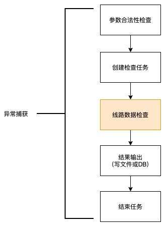
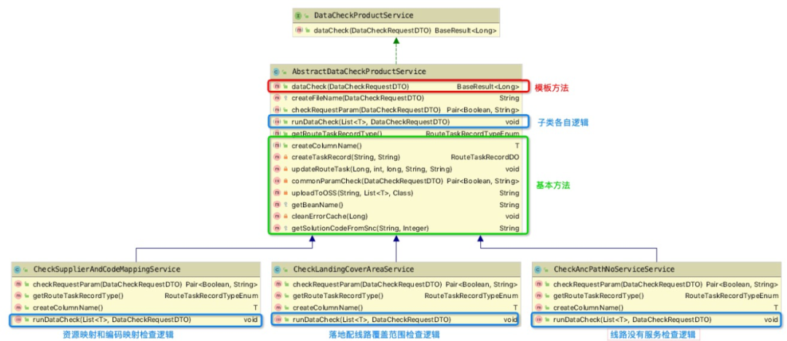
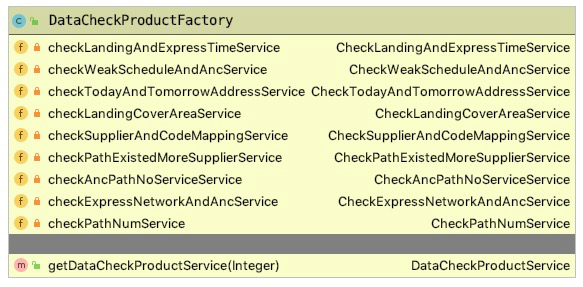

**示例代码**

[pattern-demo.ppt](https://www.yuque.com/attachments/yuque/0/2024/ppt/22811459/1721053280545-522c8df4-9595-4c3e-b662-d9d1959e8781.ppt)

_<font style="color:#DF2A3F;">注：将ppt后缀名改为zip后解压</font>_

jdk版本：1.8.0_181 


**本次分享内容**

1. <font style="color:rgb(51, 51, 51);">业务场景描述</font>
2. <font style="color:rgb(51, 51, 51);">设计模式(模板方法模式、策略模式、工厂模式、代理模式)</font>
3. 总结


<font style="color:rgb(51, 51, 51);">本节课重点在于说明工作中所使用的设计模式，为了能够更好的理解设计模式，首先简单介绍一下业务场景。使用设计模式，可以简化代码、提高扩展性、可维护性和复用性。有哪些设计模式，这里就不再介绍了，网上很多， 本次只介绍所用到设计模式。</font>

### <font style="color:rgb(51, 51, 51);">一  业务场景描述</font>
#### <font style="color:rgb(51, 51, 51);">1  意义</font>
<font style="color:rgb(51, 51, 51);">本次业务场景为线路检查工具，为什么需要线路检查工具呢，有以下几个方面的原因：</font>

+ <font style="color:rgb(51, 51, 51);">每逢大促都需要进行各网络和各行业的线路调整，调整完成之后，是否得到期望状态，需要检查确认。</font>
+ <font style="color:rgb(51, 51, 51);">上下游应用之间数据的一致性检查，如果存在不一致，可能会在订单履行时造成卡单。</font>
+ <font style="color:rgb(51, 51, 51);">有些问题发生后，业务同学需要全面检查一遍线路数据，判断是否符合预期。</font>
+ <font style="color:rgb(51, 51, 51);">各领域之间的数据变更缺乏联动性，导致资源和线路出现不一致。</font>

<font style="color:rgb(51, 51, 51);">为什么要把线路检查工具产品化呢，考虑如下：</font>

+ <font style="color:rgb(51, 51, 51);">以前每次大促，都是技术同学现场编写代码捞数据给到业务同学，而且因为人员流动性较大，代码可复用性较低，导致重复劳动。产品化后，可以方便地传承下去，避免不必要的重复劳动。</font>
+ <font style="color:rgb(51, 51, 51);">每次因为时间紧急，现场写的代码都比较简单，经常是直接将数据打印到标准输出，然后复制出来，人工拆分转成 Excel 格式；这样的过程要进行多次，占用太多技术同学的时间。产品化后，解放了技术同学，业务同学可以自己在页面操作。</font>
+ <font style="color:rgb(51, 51, 51);">很多数据检查，是每次大促都会进行的，业务同学与技术同学之间来回沟通的成本较高。产品化后，可以避免这些耗时耗力的沟通，大家可以把更多的时间放在其他的大促保障工作上。</font>

#### <font style="color:rgb(51, 51, 51);">2  检查项</font>
<font style="color:rgb(51, 51, 51);">根据 2020 年 D11 进行的数据检查，本次共实现 8 项，下面列举了 4 项，如下：</font>

+ <font style="color:rgb(51, 51, 51);">时效对齐检查：确保履行分单正常。</font>
+ <font style="color:rgb(51, 51, 51);">弱控线路与表达网络一致性：确保履行和路由不会因为线路缺失而卡单。</font>
+ <font style="color:rgb(51, 51, 51);">资源映射和编码映射一致：前者是表达线路时所用，后者是订单履约时所用，确保表达和履约能够一致。</font>
+ <font style="color:rgb(51, 51, 51);">检查线路数量：统计现存线路的情况。</font>

<font style="color:rgb(51, 51, 51);">好了，了解了背景知识，下面开始介绍所用到的设计模式，以及为什么要用、怎么用。</font>

### <font style="color:rgb(51, 51, 51);">二  设计模式</font>
#### <font style="color:rgb(51, 51, 51);">1  模板方法模式 + 泛型</font>
<font style="color:rgb(51, 51, 51);">上述 8 项数据检查工具，大致的处理流程是类似的，如下：</font>



<font style="color:rgb(51, 51, 51);">针对不同的检查工具，只有 “线路数据检查” 这一步是不一样的逻辑，其他步骤都是相同的，如果每个检查工具都实现这么一套逻辑，必定造成大量的重复代码，维护性较差。 </font>

<font style="color:rgb(51, 51, 51);">模板方法模式能够很好地解决这个问题。模板方法设计模式包含模板方法和基本方法，模板方法包含了主要流程；基本方法是流程中共用的逻辑，如创建检查任务，结果输出等等。 </font>

<font style="color:rgb(51, 51, 51);">下图是所实现的模板方法模式的类继承关系： </font>



<font style="color:rgb(51, 51, 51);">分析如下：</font>

<font style="color:rgb(51, 51, 51);">1）DataCheckProductService 接口为对外提供的服务，dataCheck 方法为统一的数据检查接口。</font>

<font style="color:rgb(51, 51, 51);">2）AbstractDataCheckProductService 是一个抽象类，设定模板，即在 dataCheck 方法中设定好流程，包括如下：</font>

+ <font style="color:rgb(51, 51, 51);">commonParamCheck 方法：进行参数合法性检查，不合法的情况下，直接返回。</font>
+ <font style="color:rgb(51, 51, 51);">createFileName 方法：创建文件名称。</font>
+ <font style="color:rgb(51, 51, 51);">createTaskRecord 方法：创建检查任务。</font>
+ <font style="color:rgb(51, 51, 51);">runDataCheck 方法：进行数据检查，这是一个抽象方法，所有检查工具都要实现此方法，以实现自己的逻辑。</font>
+ <font style="color:rgb(51, 51, 51);">uploadToOSS 方法：将检查结果上传到 OSS，便于下载。</font>
+ <font style="color:rgb(51, 51, 51);">updateRouteTask 方法：结束时更新任务为完成。</font>

<font style="color:rgb(51, 51, 51);">dataCheck 方法为模板方法，runDataCheck 方法由各个子类去实现，其他方法是基本方法。还有一些其他方法，是各个检查工具都需要使用的，所以就放在了父类中。</font>

<font style="color:rgb(51, 51, 51);">3）CheckSupplierAndCodeMappingService 类、CheckLandingCoverAreaService 类和 CheckAncPathNoServiceService 类为具体的检查工具子类，必须实现 runDataCheck 方法。</font>

<font style="color:rgb(51, 51, 51);">因为不同检查项检的查结果的格式是不一样的，所以使用了泛型，使得可以兼容不同的检查结果。</font>

<font style="color:rgb(51, 51, 51);">简化的代码如下：</font>

```java
/**
 * 数据检查工具产品化对外服务接口
 * @author xxx
 * @since xxx
 * */
public interface DataCheckProductService {
    /**
     * 数据检查
     * @param requestDTO 请求参数
     * */
    <T> BaseResult<Long> dataCheck(DataCheckRequestDTO requestDTO);
}
/**
 * 数据检查工具产品化服务
 *
 * @author xxx
 * @since xxx
 * */
public abstract class AbstractDataCheckProductService implements DataCheckProductService {
    /**
     * 数据检查
     * @param requestDTO 请求参数
     * @return
     * */
    @Override
    public <T> BaseResult<Long> dataCheck(DataCheckRequestDTO requestDTO){
        try{
            //1. 参数合法性检查
            Pair<Boolean,String> paramCheckResult = commonParamCheck(requestDTO);
            if(!paramCheckResult.getLeft()){
                return BaseResult.ofFail(paramCheckResult.getRight());
            }
            //2. 创建导出任务
            String fileName = createFileName(requestDTO);
            RouteTaskRecordDO taskRecordDO = createTaskRecord(fileName, requestDTO.getUserName());
            //3. 进行数据检查
            List<T> resultList = Collections.synchronizedList(new ArrayList<>());
            runDataCheck(resultList, requestDTO);
            //4. 写入文件
            String ossUrl = uploadToOSS(fileName,resultList);
            //5. 更新任务为完成状态
            updateRouteTask(taskRecordDO.getId(),DDportTaskStatus.FINISHED.intValue(), resultList.size()-1,"",ossUrl);
            return BaseResult.ofSuccess(taskRecordDO.getId());
        }catch (Exception e){
            LogPrinter.errorLog("dataCheck-error, beanName="+getBeanName(),e);
            return BaseResult.ofFail(e.getMessage());
        }
    }
    /**
     * 进行数据检查
     * @param resultList 存放检查结果
     * @param requestDTO 请求参数
     * @return
     * */
    public abstract <T> void runDataCheck(List<T> resultList, DataCheckRequestDTO requestDTO);
}
/**
 * 检查资源映射和编码映射一致
 * @author xxx
 * @since xxx
 * */
public class CheckSupplierAndCodeMappingService extends AbstractDataCheckProductService{
    @Override
    public <T> void runDataCheck(List<T> resultList, DataCheckRequestDTO requestDTO){
        //自己的检查逻辑
    }
}
/**
 * 检查区域内落地配必须三级全覆盖
 * @author xxx
 * @since xxx
 * */
public class CheckLandingCoverAreaService extends AbstractDataCheckProductService{
    @Override
    public <T> void runDataCheck(List<T> resultList, DataCheckRequestDTO requestDTO){
        //自己的检查逻辑
    }
}
/**
 * 检查资源映射和编码映射一致
 * @author xxx
 * @since xxx
 * */
public class CheckAncPathNoServiceService extends AbstractDataCheckProductService{
    @Override
    public <T> void runDataCheck(List<T> resultList, DataCheckRequestDTO requestDTO){
        //自己的检查逻辑
    }
}
```

<font style="color:rgb(51, 51, 51);">使用模板方法模式的好处是：</font>

+ <font style="color:rgb(51, 51, 51);">简化了代码，每个工具只需要关心自己的核心检查逻辑，不需要关注前置和后置操作。</font>
+ <font style="color:rgb(51, 51, 51);">提高了扩展性，可以方便地增加新的检查工具。</font>
+ <font style="color:rgb(51, 51, 51);">统一的异常捕获和处理逻辑，子类有异常，尽管往外抛出。</font>

#### <font style="color:rgb(51, 51, 51);">2  策略模式</font>
<font style="color:rgb(51, 51, 51);">之所以会用到策略模式，是因为一些检查工具写完之后，发现跑出来的结果数据太多，有几万、几十万等等，一方面，检查比较耗时，结果文件会很大，下载耗时；另一方面，这么多数据给到业务同学，他们也很难处理和分析，也许他们只是想看一下总体情况，并不想看具体的到哪个地方的线路。为此，在原先方案设计的基础上，增加了 “统计信息” 的选项，让用户可以自行选择 “详细信息” 还是“统计信息”，对应到页面上就是一个单选框，如下：</font>


<font style="color:rgb(51, 51, 51);">现在增加了一种检查方式，今后是否还会有其他的检查方式？完全有可能的。所以得考虑到扩展性，便于后面同学增加新的检查方式。</font>

<font style="color:rgb(51, 51, 51);">此外，还有一种场景也可以使用策略模式，那就是业务系统中有很多业务网络，不同网络之间有一些差异；本次所实现的检查工具，有几个涉及到多个网络，今后可能会涉及到所有网络。</font>

<font style="color:rgb(51, 51, 51);">综合以上两种场景，最合适的就是策略模式了。“详细信息”和 “统计信息” 各采用一种策略，不同网络使用不同的策略，既便于代码理解，又便于后续扩展。</font>

<font style="color:rgb(51, 51, 51);">“详细信息”和 “统计信息” 两种检查结果的策略类图如下：</font>


<font style="color:rgb(51, 51, 51);">解析：</font>

+ <font style="color:rgb(51, 51, 51);">CompareModeStrategy 对外提供统一的结果处理接口 doHandle，策略子类必须实现此接口。</font>
+ <font style="color:rgb(51, 51, 51);">SupplierAndCodeMappingStatisticsStrategy 和 SupplierAndCodeMappingDetailStrategy 是检查配送资源和编码映射一致性的两种结果信息方式，前者为统计方式，后者为详细方式。</font>
+ <font style="color:rgb(51, 51, 51);">LandingCoverAreaStatisticsStrategy 和 LandingCoverAreaDetailStrategy 是检查落地配覆盖范围的两种结果信息方式，前者为统计方式，后者为详细方式。</font>
+ <font style="color:rgb(51, 51, 51);">那 AbstractCompareModeStrategy 是干什么用的？它是一个抽象类，负责承接所有策略子类共用的一些方法。</font>

<font style="color:rgb(51, 51, 51);">简化的代码如下：</font>

```java
/**
 * 检查结果策略对外接口
 * @author xxx
 * @since xxx
 * */
public interface CompareModeStrategy {
    /**
     * 具体操作
     *
     * @param list
     * @param requestDTO
     * @return 结果集
     * */
    <T> List<T> doHandle(List<CompareBO> list, DataCheckRequestDTO requestDTO);
}
/**
 * 策略公共父类
 *
 * @author xxx
 * @since xxx
 * @apiNote 主要是将子类共用方法和成员抽离出来
 * */
public abstract class AbstractCompareModeStrategy implements CompareModeStrategy {
    //子类的共用方法，可以放在此类中
}
/**
 * 检查落地配覆盖范围 详细信息 策略类
 * @author xxx
 * @since xxx
 * */
public class LandingCoverAreaDetailStrategy extends AbstractCompareModeStrategy{
    @Override
    public <T> List<T> doHandle(List<CompareBO> list, DataCheckRequestDTO requestDTO){
        List<T> resultList = new ArrayList<>();
        //检查结果处理逻辑
        return resultList;
    }
}
/**
 * 检查落地配覆盖范围 统计信息 策略类
 * @author xxx
 * @since xxx
 * */
public class LandingCoverAreaStatisticsStrategy extends AbstractCompareModeStrategy{
    @Override
    public <T> List<T> doHandle(List<CompareBO> list, DataCheckRequestDTO requestDTO){
        List<T> resultList = new ArrayList<>();
        //检查结果处理逻辑
        return resultList;
    }
}
/**
 * 检查配送资源和编码映射一致 详细信息 策略类
 * @author xxx
 * @since xxx
 * */
public class SupplierAndCodeMappingDetailStrategy extends AbstractCompareModeStrategy{
    @Override
    public <T> List<T> doHandle(List<CompareBO> list, DataCheckRequestDTO requestDTO){
        List<T> resultList = new ArrayList<>();
        //检查结果处理逻辑
        return resultList;
    }
}
/**
 * 检查配送资源和编码映射一致 统计信息 策略类
 * @author xxx
 * @since xxx
 * */
public class SupplierAndCodeMappingStatisticsStrategy extends AbstractCompareModeStrategy{
    @Override
    public <T> List<T> doHandle(List<CompareBO> list, DataCheckRequestDTO requestDTO){
        List<T> resultList = new ArrayList<>();
        //检查结果处理逻辑
        return resultList;
    }
}
```

<font style="color:rgb(51, 51, 51);">同样，不同网络的处理策略类图如下： </font>


<font style="color:rgb(51, 51, 51);">代码与上面类似，就不展示了。</font>

<font style="color:rgb(51, 51, 51);">使用策略模式的好处是： </font>

+ <font style="color:rgb(51, 51, 51);">提高代码扩展性，后续增加别的结果格式或别的网络处理逻辑，可以在不修改其他策略的情况下直接新增。</font>
+ <font style="color:rgb(51, 51, 51);">提高代码可读性，取代了 if...else，条理清晰。</font>
+ <font style="color:rgb(51, 51, 51);">不同系列采用不同的策略，策略与策略之间可以嵌套使用，形成策略的叠加效用。</font>

#### <font style="color:rgb(51, 51, 51);">3  工厂模式</font>
<font style="color:rgb(51, 51, 51);">工厂模式解决的是 bean 的生产问题，简单工厂模式根据入参生产不同的 bean，普通工厂模式针对每个 bean 都构建一个工厂，此两者各有优劣，看需要。本方案采用的是简单工厂模式。</font>

<font style="color:rgb(51, 51, 51);">之所以使用工厂模式，是因为有太多的 bean 需要构造，如果在业务逻辑中构造各种 bean，则会显得凌乱和分散，所以需要一个统一生成 bean 的地方，更好地管理和扩展。</font>

<font style="color:rgb(51, 51, 51);">本方案中主要有三类 bean 需要工厂来生成：</font>

+ <font style="color:rgb(51, 51, 51);">模板方法模式中所用到的子类。</font>
+ <font style="color:rgb(51, 51, 51);">检查结果格式策略中所用到的子类。</font>
+ <font style="color:rgb(51, 51, 51);">不同网络处理策略中所用到的子类。</font>

<font style="color:rgb(51, 51, 51);">所以，使用三个工厂分别构造这三种类型的 bean。另外，因为每个 bean 主要的功能都在方法中，不涉及类变量的使用，所以可以利用 spring 容器生成的 bean，而不是我们自己 new 出来，这样就使得 bean 可以重复使用。因此，这里的工厂只是 bean 的决策（根据参数决定使用哪个 bean），不用自己 new 了。</font>

<font style="color:rgb(51, 51, 51);">三个工厂分别如下：</font>

+ <font style="color:rgb(51, 51, 51);">DataCheckProductFactory：由 getDataCheckProductService 方法根据输入参数决策使用哪个数据检查工具。</font>
+ <font style="color:rgb(51, 51, 51);">CompareModeStrategyFactory：用于决策使用哪种格式输出，因为将输出策略分为了 2 类（详细信息和统计信息），所以需要传入两个参数才能决定使用哪种策略。</font>
+ <font style="color:rgb(51, 51, 51);">DataCheckNetworkStrategyFactory：用于决策使用哪种网络处理策略，因为将策略分为了 2 类（4PL 网络和其他网络），所以需要传入两个参数才能决定使用哪种策略。</font>




<font style="color:rgb(51, 51, 51);">这三个工厂的代码类似，这里就以 CompareModeStrategyFactory 为例，简化的代码如下：</font>

```java
/**
 * 比对结果集方式
 * @author xxx
 * @since xxx
 * */
@Service
public class CompareModeStrategyFactory {
    /************************ 详细结果的bean  **************************/
    @Resource
    private LandingCoverAreaDetailStrategy landingCoverAreaDetailStrategy;
    @Resource
    private SupplierAndCodeMappingDetailStrategy supplierAndCodeMappingDetailStrategy;
    /************************ 统计结果的bean  **************************/
    @Resource
    private LandingCoverAreaStatisticsStrategy landingCoverAreaStatisticsStrategy;
    @Resource
    private SupplierAndCodeMappingStatisticsStrategy supplierAndCodeMappingStatisticsStrategy;
    /**
     * 获取比对结果的策略
     * */
    public CompareModeStrategy getCompareModeStrategy(DataCheckProductEnum productEnum, DataCompareModeEnum modeEnum){
        CompareModeStrategy compareModeStrategy = null;
        switch (modeEnum){
            case DETAIL_INFO:
                compareModeStrategy = getDetailCompareModeStrategy(productEnum);
                break;
            case STATISTICS_INFO :
                compareModeStrategy = getStatisticsCompareModeStrategy(productEnum);
                break;
            default:;
        }
        return compareModeStrategy;
    }
    /**
     * 获取 详细信息 策略对象
     * */
    private CompareModeStrategy getDetailCompareModeStrategy(DataCheckProductEnum productEnum){
        CompareModeStrategy compareModeStrategy = null;
        switch (productEnum){
            case CHECK_LANDING_COVER_AREA:
                compareModeStrategy = landingCoverAreaDetailStrategy;
                break;
            case CHECK_SUPPLIER_AND_CODE_MAPPING:
                compareModeStrategy = supplierAndCodeMappingDetailStrategy;
                break;
            default:;
        }
        return compareModeStrategy;
    }
    /**
     * 获取 统计信息 策略对象
     * */
    private CompareModeStrategy getStatisticsCompareModeStrategy(DataCheckProductEnum productEnum){
        CompareModeStrategy compareModeStrategy = null;
        switch (productEnum){
            case CHECK_LANDING_COVER_AREA:
                compareModeStrategy = landingCoverAreaStatisticsStrategy;
                break;
            case CHECK_SUPPLIER_AND_CODE_MAPPING:
                compareModeStrategy = supplierAndCodeMappingStatisticsStrategy;
                break;
            default:;
        }
        return compareModeStrategy;
    }
}
```

<font style="color:rgb(51, 51, 51);">使用工厂模式的好处是：</font>

+ <font style="color:rgb(51, 51, 51);">便于 bean 的管理，所有的 bean 都在一处创建（或决策）。</font>
+ <font style="color:rgb(51, 51, 51);">条理清晰，便于阅读和维护。</font>

#### <font style="color:rgb(51, 51, 51);">4“代理模式”</font>
<font style="color:rgb(51, 51, 51);">这个代理模式是打着双引号的，因为不是真正的代理模式，只是从实现方式上来说，具有代理模式的意思。为什么需要用到代理模式？是因为类太多了，业务逻辑分散在各个类中，有的在模板子类中，有的在网络策略中，有的在结果输出格式策略中，而这些业务逻辑都需要多线程执行和异常捕获。如果有个代理类，能够收口这些处理逻辑，只需增加前置多线程处理和后置异常处理即可。</font>

<font style="color:rgb(51, 51, 51);">Java 语言中的函数式编程，具备这种能力。所谓函数式编程，是指能够将方法当做参数传递给方法，前面 “方法” 是业务逻辑，后面 “方法” 是代理，将业务逻辑传递给代理，就实现了统一收口的目的。 </font>

<font style="color:rgb(51, 51, 51);">能够实现此功能的接口有四个，分别是：Consumer、Supplier、Predicate 与 Function，怎么使用可以网上查询。本方案使用的是 Consumer，因为它是用来消费的，即需要传入一个参数，没有返回值，符合本方案的设计。 </font>

<font style="color:rgb(51, 51, 51);">简化后的代码如下： </font>

```java
@Service
public class CheckLandingCoverAreaService extends AbstractDataCheckProductService {
    @Override
    public <T> void runDataCheck(List<T> resultList, DataCheckRequestDTO requestDTO){
        dataCheckUtils.parallelCheckByFromResCodes(requestDTO,requestDTO.getFromResCodeList(),fromResCode->{
            ExpressNetworkQuery query = new ExpressNetworkQuery();
            query.setNs(NssEnum.PUB.getId());
            query.setStatus(StatusEnum.ENABLE.getId());
            query.setGroupNameList(requestDTO.getGroupNameList());
            query.setBrandCodeList(requestDTO.getBrandCodeList());
            query.setFromResCode(fromResCode);
            List<TmsMasterExpressNetworkDO> masterExpressNetworkDOS = tmsMasterExpressNetworkService.queryExpressNetworkTimeList(query);
            startCompareWithAnc(resultList,requestDTO,masterExpressNetworkDOS,fromResCode,solutionCodeMap);
        });
    }
}
@Service
public class DataCheckUtils {
    /**
     * 并行处理每个仓
     * @param requestDTO 请求参数
     * @param fromResCodeList 需要检查的仓列表
     * @param checkOperation 具体的业务处理逻辑
     * */
    public <T> void parallelCheckByFromResCodes(DataCheckRequestDTO requestDTO, List<String> fromResCodeList, Consumer<String> checkOperation){
        List<CompletableFuture> futureList = Collections.synchronizedList(new ArrayList<>());
        fromResCodeList.forEach(fromResCode->{
            CompletableFuture future = CompletableFuture.runAsync(() -> {
                try{
                    checkOperation.accept(fromResCode);
                }catch (Exception e){
                    LogPrinter.errorLog("parallelCheckByFromResCodes-error, taskId="+requestDTO.getTaskId(),e);
                    recordErrorInfo(requestDTO.getTaskId(),e);
                }
            }, DATA_CHECK_THREAD_POOL);
            futureList.add(future);
        });
        //等待所有线程结束
        futureList.forEach(future->{
            try{
                future.get();
            }catch (Exception e){
                LogPrinter.errorLog("parallelCheckByFromResCodes-future-get-error",e);
            }
        });
    }
}
```

<font style="color:rgb(51, 51, 51);">可以看出，Consumer 所代表的就是一个方法，将此方法作为 parallelCheckByFromResCodes 方法的一个参数，在 parallelCheckByFromResCodes 中进行多线程和异常处理，既能统一收口，又大大减少了重复代码。</font>

<font style="color:rgb(51, 51, 51);">代理模式的好处是：</font>

+ <font style="color:rgb(51, 51, 51);">统一收口多种不同的业务逻辑，统一做日志和异常处理。</font>
+ <font style="color:rgb(51, 51, 51);">减少重复代码，提高了代码质量。</font>
+ <font style="color:rgb(51, 51, 51);">可维护性较强。</font>

#### <font style="color:rgb(51, 51, 51);">5  其他</font>
<font style="color:rgb(51, 51, 51);">像结果输出格式策略模式那样，虽然 AbstractCompareModeStrategy 没有实际的业务逻辑，但仍然把它作为一个基类，目的是所有子类共用的逻辑或方法，能够放在此类中，减少代码量，提升维护性。 </font>

<font style="color:rgb(51, 51, 51);">但是有的时候，不是继承自同一个基类的子类们，仍然要共用一些逻辑或方法（如 parallelCheckByFromResCodes 方法），但 Java 语言限制一个类只能继承一个基类，怎么办呢？简单的办法就是把这些共用逻辑或方法放到一个工具类（如 DataCheckUtils）中。</font>

### <font style="color:rgb(51, 51, 51);">三  总结</font>
1. <font style="color:rgb(51, 51, 51);">将提升代码可读性、可扩展性和可维护性的意识注入到平时的项目中，便于自己，利于他人。如果项目紧急没时间考虑很多，希望之后有时间时能够改善和优化。</font>
2. <font style="color:rgb(51, 51, 51);">工作不仅是为了完成任务，更是提升自己的过程。能力要用将来进行时。</font>

  
 

