# <font style="color:#ED740C;">1.前言</font>
随着大环境的发展，很多公司开始逐步迁移使用国产数据库代替原有的数据库，为了让大家更加方便的学习，本篇文章给大家带来国产数据库-达梦的安装教程

# <font style="color:#ED740C;">2.环境准备</font>
达梦数据库支持Windows、Linux和Unix操作系统，我们学习的话在本机使用VM安装一个Centos，然后<font style="color:rgb(18, 18, 18);">去</font>[达梦官网下载](https://www.dameng.com/list_103.html)<font style="color:rgb(18, 18, 18);">适用自己平台的安装包。</font>

<font style="color:rgb(18, 18, 18);">达梦正式版需要授权，自学选择试用版就可以了。本教程使用的是VM安装的centos7.2。所以选择X86架构、Centos7的安装包。</font>

```powershell
# 查看CPU以及整个系统的架构相关信息
lscpu
# 查看系统版本
cat /etc/redhat-release
# 查看系统位数
getconf LONG_BIT
```

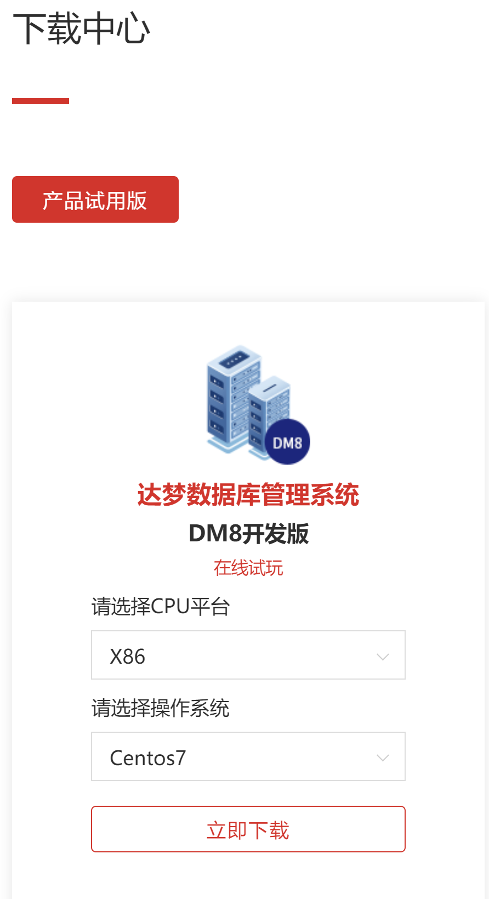

# <font style="color:#ED740C;">3.安装</font>
为了更好的管理用户与资源消耗，我们可以添加一个用户组专门处理达梦数据库。

## <font style="color:#A58F04;">3.1.添加用户</font>
```powershell
# 添加组
groupadd dinstall
# 添加安装用户
useradd -g dinstall dmdba
# 设置dmdba密码：dameng123123
echo "dameng123123" | passwd dmdba --stdin
```


## <font style="color:#A58F04;">3.2.切换到dmdba账户，查看限制信息，使用root账户修改dmdba用户资源限制</font>
```powershell
# 切换到dmdba账户，查看当前用户限制信息
id dmdba
ulimit -a
```


```powershell
# 使用root账户修改配置
cat >> /etc/security/limits.conf << EOF
dmdba    soft    nofile    65536
dmdba    hard    nofile    65536	
EOF
```


<font style="color:#DF2A3F;">验证是否修改成功：</font>


## <font style="color:#A58F04;">3.3.统一管理应用</font>
```powershell
# 使用root账号根目录创建app/dmDB8文件夹
mkdir -p /app/dmDB8
# 数据文件存放目录
mkdir -p /app/dmDB8/installData
# 达梦安装文件目录
mkdir -p /app/dmDB8/data
# 开通dmdba权限
chown dmdba:dinstall /app/dmDB8/ /app/dmDB8/data /app/dmDB8/installData
# 或者
chown -R dmdba:dinstall /app/dmDB8
```


## <font style="color:#A58F04;">3.4.关闭防火墙</font>
```powershell
# 检查防火墙状态
firewall-cmd --state
# 停止并禁用防火墙
systemctl stop firewalld
systemctl disable firewalld
# 删除防火墙
yum remove firewalld
```


## <font style="color:#A58F04;">3.5.安装依赖包</font>
<font style="color:#E4495B;">检查依赖包是否正常，缺少哪个依赖就安装哪个即可。注意需要使用root用户才能安装</font>

```powershell
# 检查是否安装相关依赖
rpm -q glibc
rpm -q libXp
rpm -q libXt
rpm -q libXtst
# 安装依赖
yum install glibc
yum install libXp
yum install libXt
yum install libXtst
```


安装后重新检查：


## <font style="color:#A58F04;">3.6.上传安装包，解压安装包并挂载镜像文件</font>


```powershell
unzip dm8_20230418_x86_rh6_64.zip
mount -o loop dm8_20230418_x86_rh6_64.iso /mnt
```


<font style="color:#E4495B;">切换到dmdba用户</font>，然后进入mnt目录查看文件；调用bin文件开始安装，如果没有安装图形化软件将出现以下提示

```powershell
cd /mnt/
# 192.168.10.50本机ip
export DISPLAY=192.168.10.50:0.0
./DMInstall.bin
```


## <font style="color:#A58F04;">3.7.本机安装Xmanager</font>
## <font style="color:#A58F04;">3.8.图形化安装</font>
### <font style="color:#E4495B;">3.8.1.安装完后Xmanager，linux指定本机端口，然后图形化安装</font>
```powershell
# 192.168.10.50本机ip
export DISPLAY=192.168.10.50:0.0
./DMInstall.bin
```

### <font style="color:#E4495B;">3.8.2.启用图形化之后，使用默认配置即可，一直下一步</font>


### <font style="color:#E4495B;">3.8.3.学习使用，不用填写key，直接下一步</font>
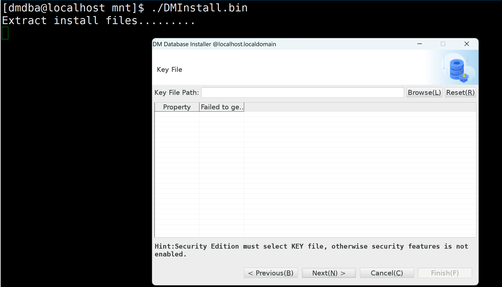


### <font style="color:#E4495B;">3.8.4.注意安装到对应的自定义目录，并且安装文件夹需要是空的。</font>  

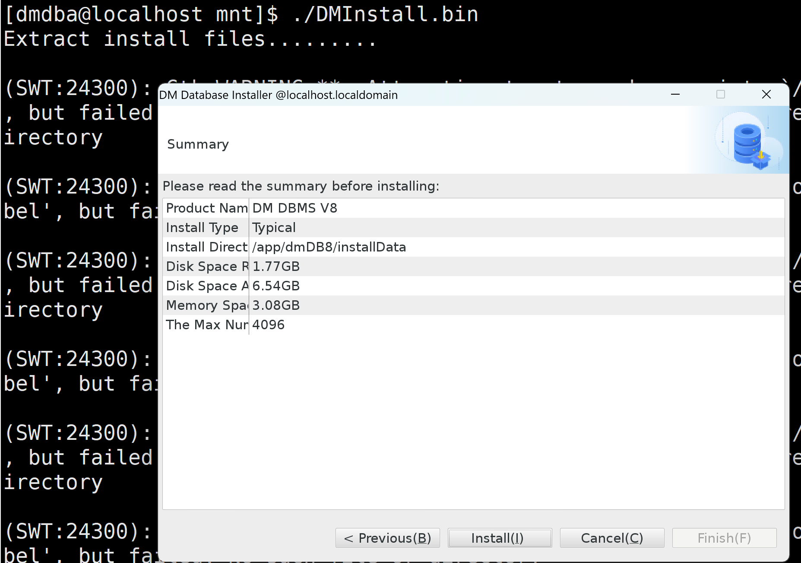


### <font style="color:#E4495B;">3.8.5.安装完成之后，一定不要直接点OK，认真观看提示。</font>


### <font style="color:#E4495B;">3.8.6.到这一步之后，先复制软件提供的命令，然后使用root账号执行</font>


### <font style="color:#E4495B;">3.8.7.点击OK-->finish</font>


### <font style="color:#E4495B;">3.8.8.点击init初始化数据库，出现以</font><font style="color:#DF2A3F;"></font><font style="color:#E4495B;">下界面，开始创建数据库，又或者是使用tool目录下的工具初始化数据库</font>


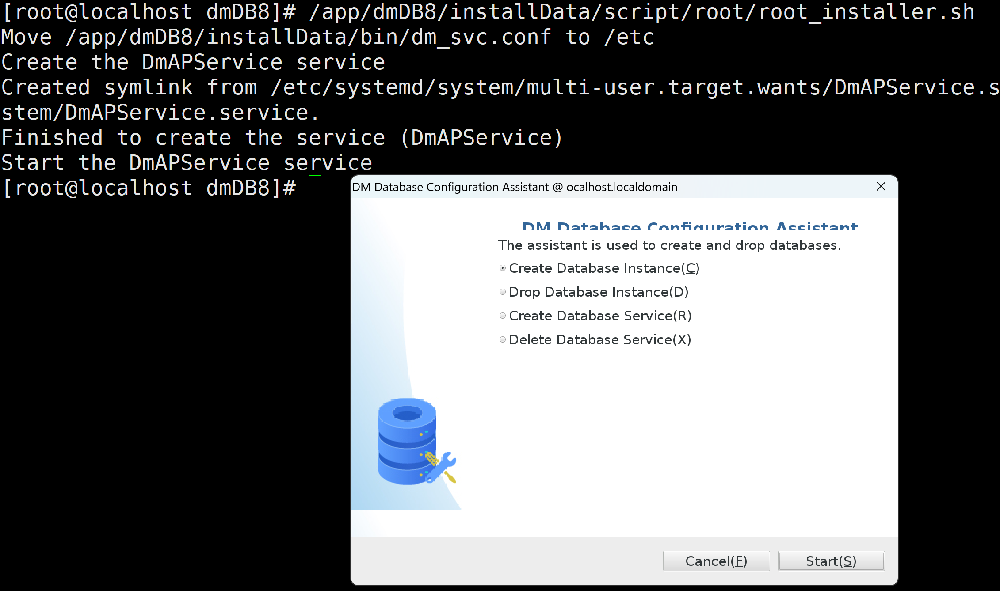

## <font style="color:#A58F04;">3.9.初始化数据库</font>
### <font style="color:#DF2A3F;">3.9.1.观察下达梦数据库的安装目录</font>
```powershell
# bin执目录，tool工具目录
cd /app/dmDB8/installData/
```

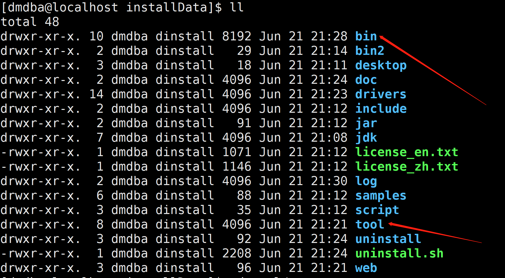

### <font style="color:#DF2A3F;">3.9.2.使用命令创建数据库</font>
```powershell
# 直接使用
/app/dmDB8/installData/tool/dbca.sh
# 或者进入到tool目录
./dbca.sh 
```


### <font style="color:#DF2A3F;">3.9.3.需要修改下数据库对应文件所在位置</font>
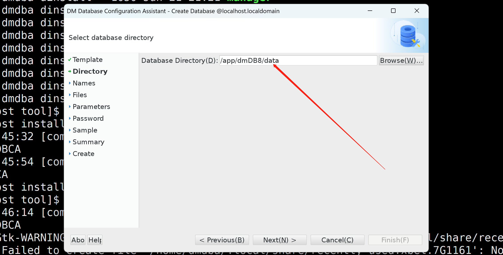

### <font style="color:#DF2A3F;">3.9.4.下一步之后，可以修改数据名称与实例名</font>


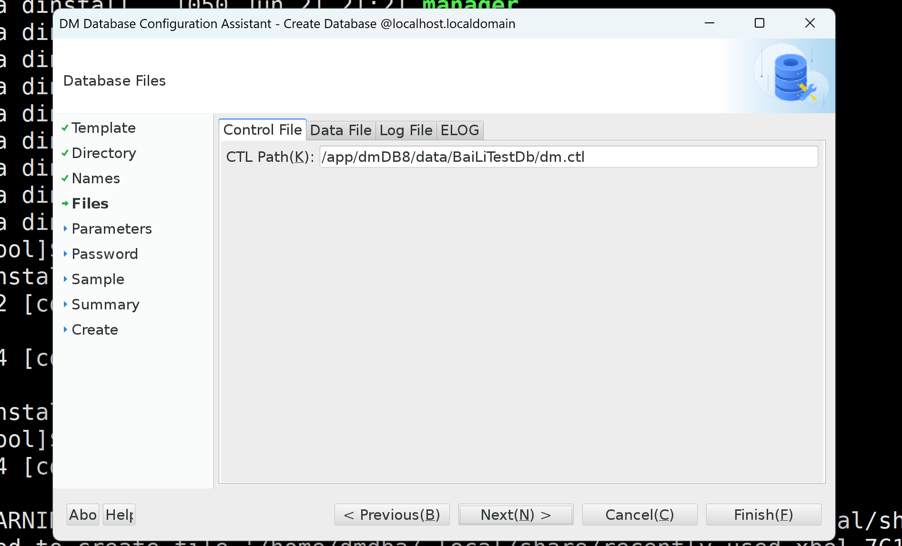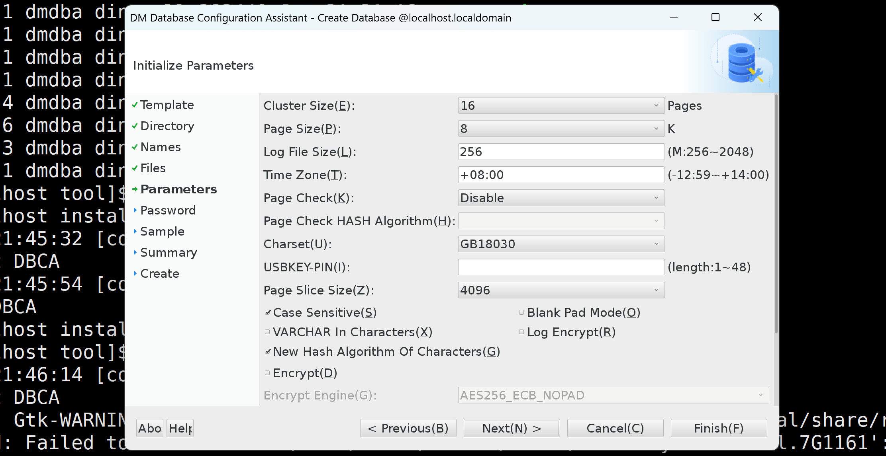

### <font style="color:#DF2A3F;">3.9.5.设置统一密码，我这边设置：dameng123</font>


### <font style="color:#DF2A3F;">3.9.6.选择提供完整示例demo</font>
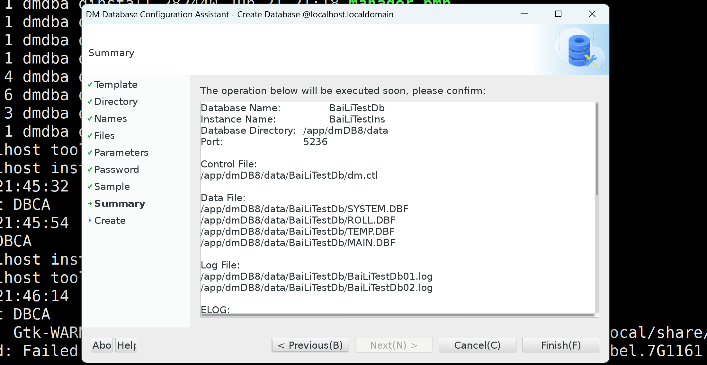

### <font style="color:#DF2A3F;">3.9.7.点击finish完成，然后开始创建，同样注意提示，用root账号执行相应命令</font>


### <font style="color:#DF2A3F;">3.9.8.执行完成之后，可以用以下命令检查状态，没有问题点击OK，然后finish</font>
```powershell
# 注意服务名称
systemctl is-enabled DmServiceBaiLiTestIns.service
	
systemctl status DmServiceBaiLiTestIns.service
```


### <font style="color:#DF2A3F;">3.9.9.再次执行命令，OK-->finish</font>


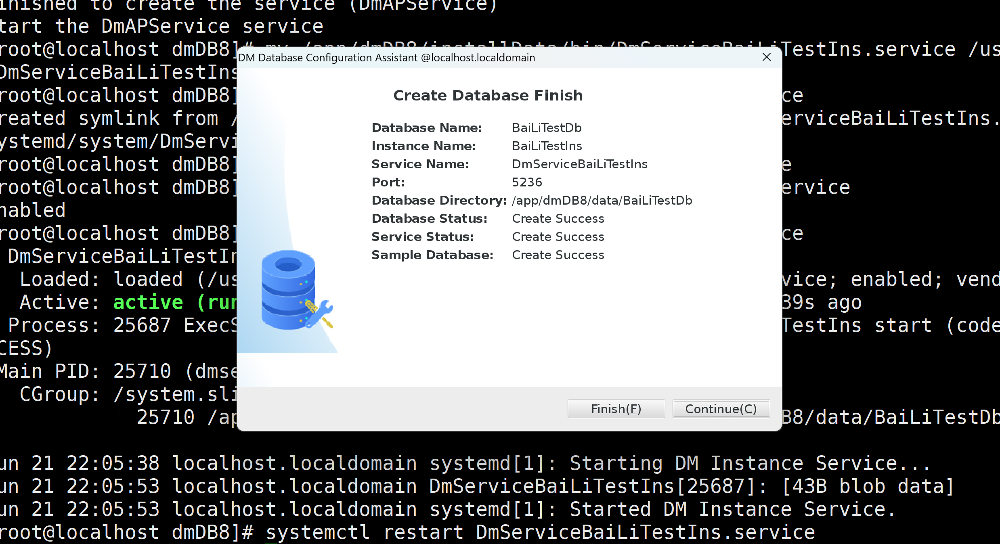

### <font style="color:#DF2A3F;">3.9.10.进入data目录查看文件</font>


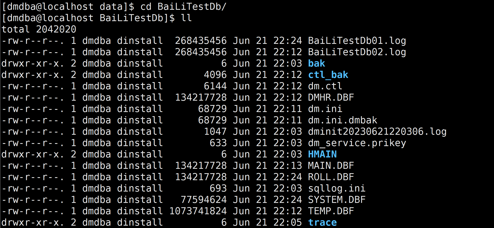

## <font style="color:#A58F04;">3.10.使用tool目录下的</font><font style="color:#A58F04;background-color:rgb(249, 250, 252);">disql</font><font style="color:#A58F04;">登录数据库，至此图形化安装完成</font>
```powershell
./disql
conn sysdba/dameng123
```

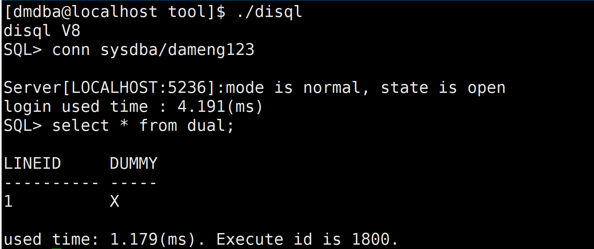

## <font style="color:#A58F04;">3.11.删除数据库</font>
删除数据库，包括删除数据库的数据文件、日志文件、控制文件和初始化参数文件。

为了保证删除数据库成功，必须保证dmserver已关闭。可以使用数据库配置工具来删除数据库。

### <font style="color:#DF2A3F;">3.11.1.使用root账户停止服务</font>
```powershell
systemctl status DmServiceBaiLiTestIns.service

systemctl stop DmServiceBaiLiTestIns
```

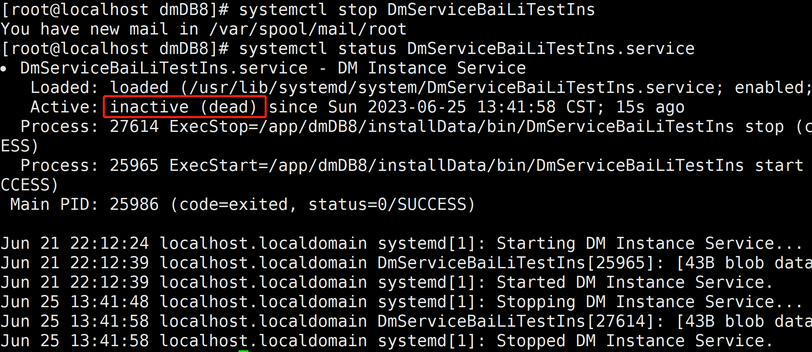

### <font style="color:#DF2A3F;">3.11.2.使用dmdba账户删除数据库，整个操作跟初始化数据库类似。直接根据界面提示操作即可。</font>
```powershell
./dbca.sh
```


### <font style="color:#DF2A3F;">3.11.3.选中需要删除的数据库</font>


### <font style="color:#DF2A3F;">3.11.4.点击finish</font>


### <font style="color:#DF2A3F;">3.11.5.进入data数据库安装目录检查是否删除完成</font>
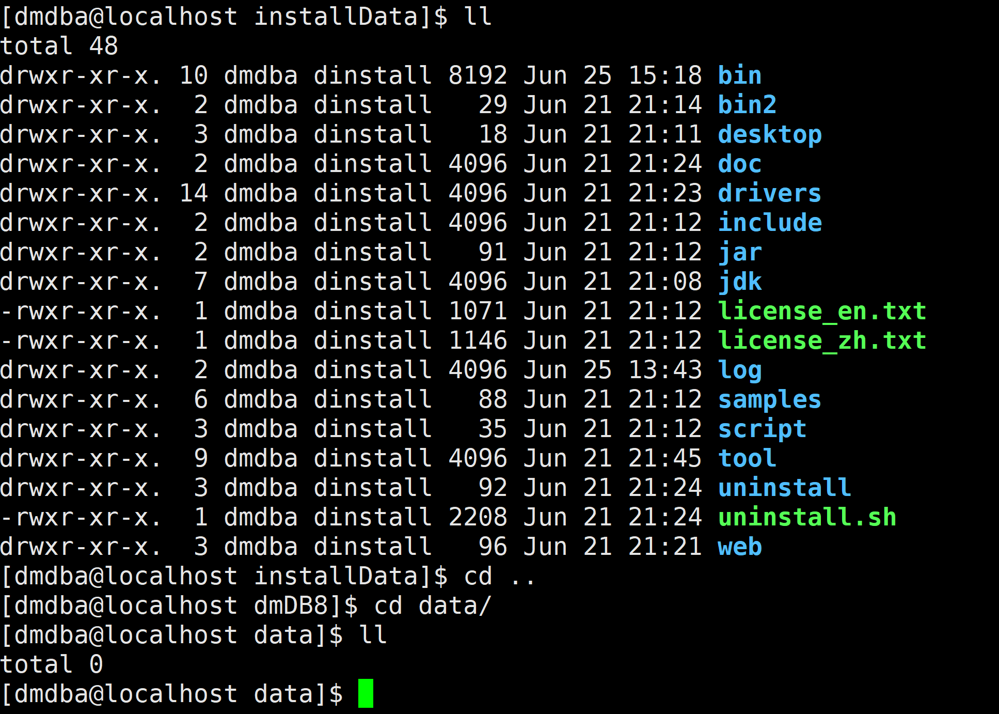

# <font style="color:#ED740C;">4.使用</font>
## <font style="color:#A58F04;">4.1.本机安装达梦客户端</font>
下载window版本安装包，解压zip得到iso文件，再解压iso文件，执行exe文件开始安装

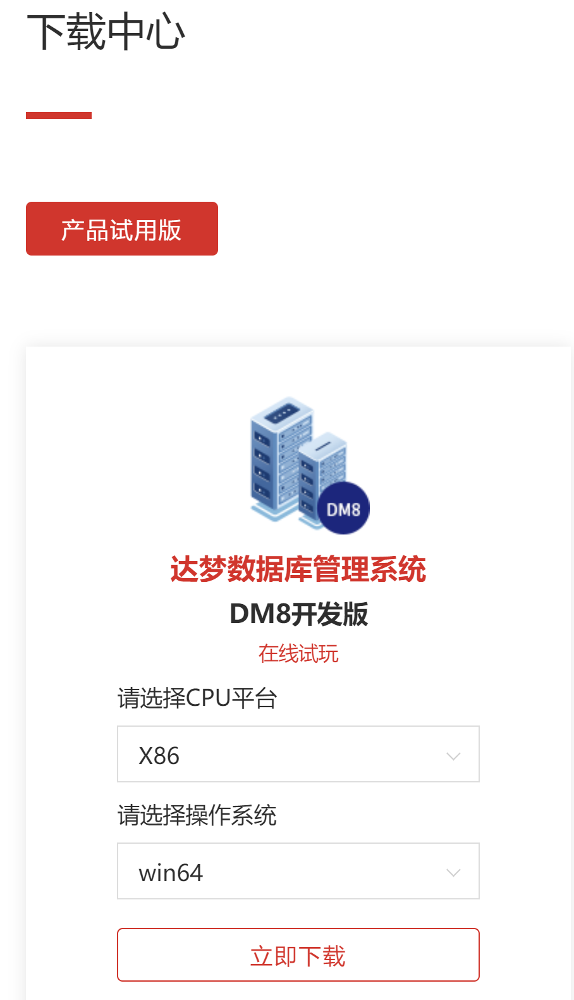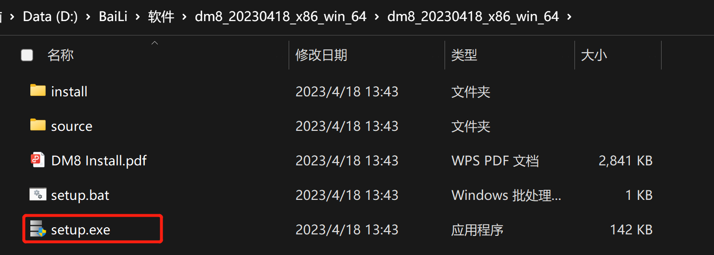


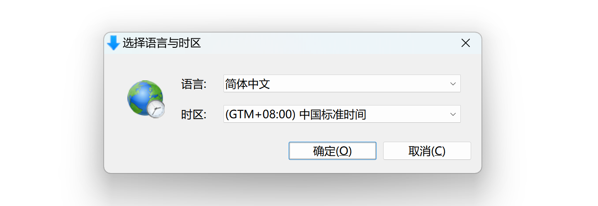

### <font style="color:#DF2A3F;">4.1.1.跟着引导开始安装</font>


### <font style="color:#DF2A3F;">4.1.2.同样的，自学我们就不填入key</font>


### <font style="color:#DF2A3F;">4.1.3.本机安装的时候选择客户端，修改下安装目录</font>


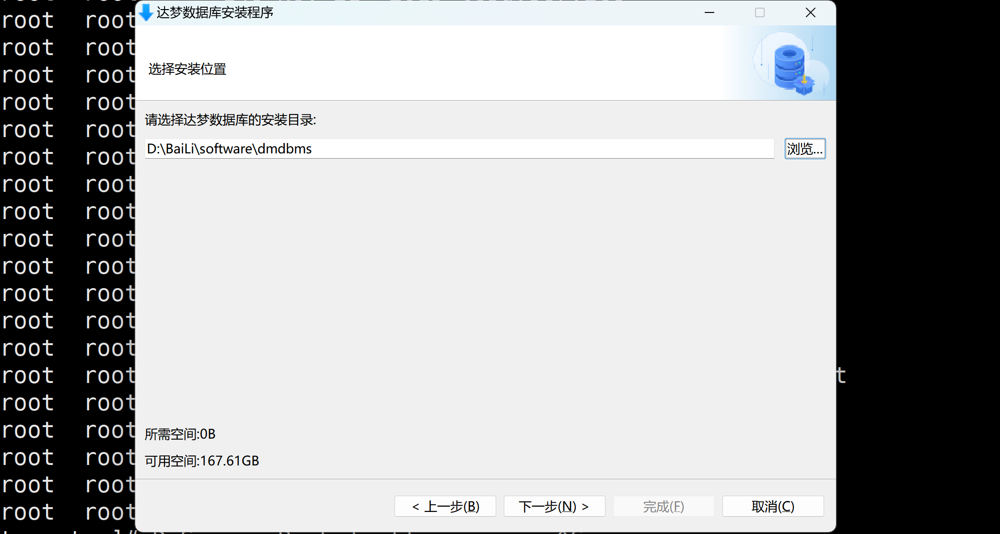

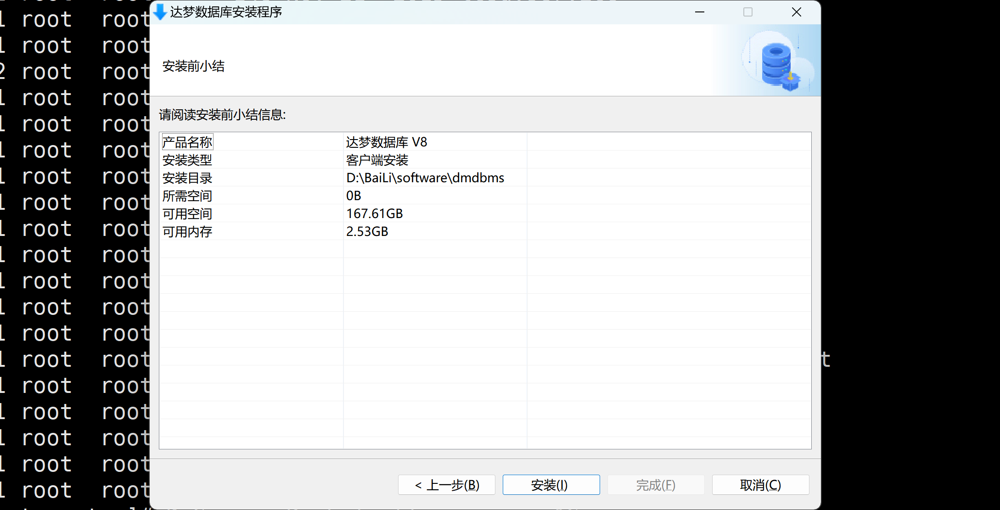

## <font style="color:#A58F04;">4.2.使用客户端连接服务器</font>
打开DM管理工具


填入服务器ip地址，输入账户、密码，远程连接


### <font style="color:#DF2A3F;">4.2.1这样就连接成功了；日常开发通常会添加一个新用户进行处理，并且新创建一个表空间。</font>
### <font style="color:#DF2A3F;">4.2.2.创建表空间</font>
选中表空间然后右键新建表空间，填入空间名，点击添加按钮，需要注意文件路径需要从服务器目录获取

我这边填入：/app/dmDB8/installData/data/BaiLiTestDBDemo/BAILI.DBF


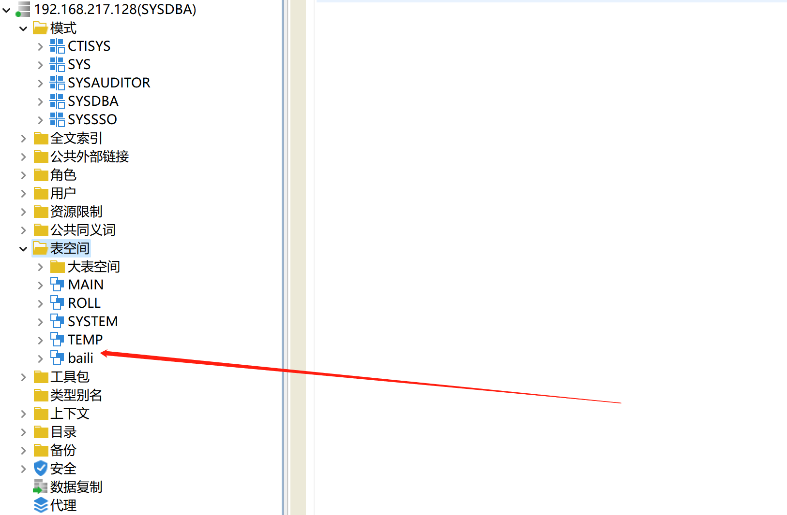

### <font style="color:#DF2A3F;">4.2.3.添加角色</font>


添加完成后，刷新可以看到用户与模式都存在BAILI


### <font style="color:#DF2A3F;">4.2.4.使用新用户登录服务器</font>
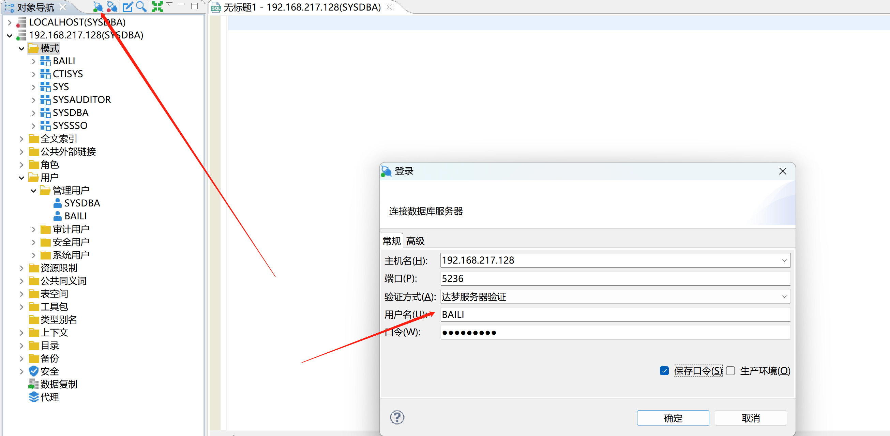

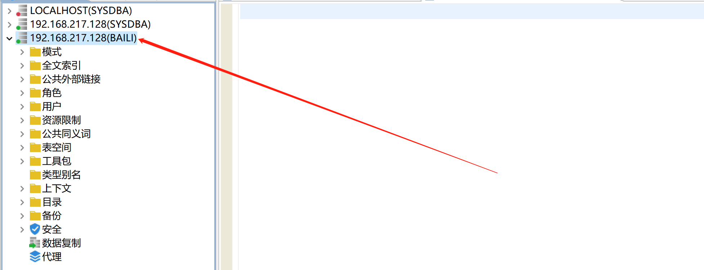

### <font style="color:#DF2A3F;">4.2.5.添加表并测试</font>
```plsql
# 创建学生表
CREATE TABLE STUDENT (
  STUNO INT CLUSTER PRIMARY KEY,
  STUNAME VARCHAR(15) NOT NULL, 
  TEANO INT, 
  CLASSID INT
);

select * from student;

insert into STUDENT ("STUNO", "STUNAME", "TEANO", "CLASSID") 
VALUES(1, 'baili', 1, 1);

update STUDENT set STUNAME = '百里' where stuno = 1;

delete from STUDENT where stuno = 1;
```


# <font style="color:#ED740C;">5.总结</font>
至此达梦数据库的安装使用教程就到此结束了。

如果有疑问或者是发现什么错误，可以在对应视频留言或者私信up主。

# <font style="color:#ED740C;">6.启动达梦数据库（补充）</font>
部署完成后，关掉服务启动方式

先进入到bin目录下，找到对应的实例，然后直接运行。


```powershell
# 启动
./DmServiceBaiLiTestInsDemo start

# 检查状态
systemctl status DmServiceBaiLiTestInsDemo

# 回到tool目录使用disql，参考目录3.10
```

