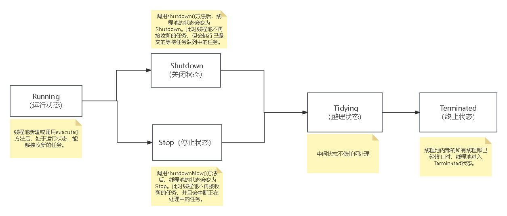
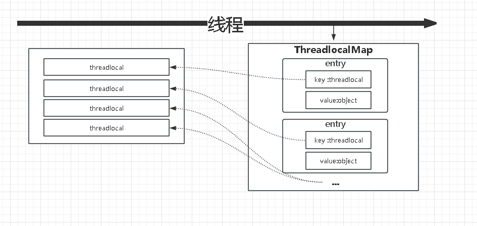
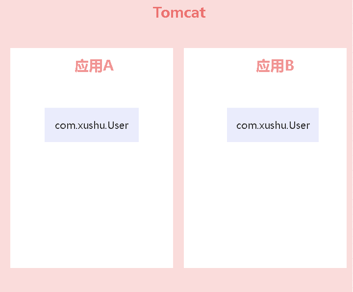

## Java中有哪几种方式来创建线程执行任务？
> <font style="background-color:#FBDE28;">薪资：8-12k</font>
>
> <font style="background-color:#C1E77E;">岗位：初级开发工程师</font>
>


### 1. 继承Thread类
```java
/**
 * 作者：徐庶
 */
public class XushuThread extends Thread{


    public static void main(String[] args) {
        XushuThread thread = new XushuThread();
        thread.start();
    }

    @Override
    public void run() {
        System.out.println("hello xushu");
    }


}
```

**<font style="color:#DF2A3F;"></font>**

**<font style="color:#DF2A3F;">总结：重写的是run()方法，而不是start()方法，但是占用了继承的名额，Java中的类是单继承的。</font>**

**<font style="color:#DF2A3F;"></font>**

> 讲到单继承，我们应该注意，java中的接口是可以多继承的
>


### 2. 实现Runnable接口
```java
/**
 * 作者：徐庶
 */
public class XushuThread implements Runnable{
    
    public static void main(String[] args) {
        Thread thread = new Thread(new XushuThread());
        thread.start();
    }

    public void run() {
        System.out.println("hello xushu");
    }
    
}
```


**<font style="color:#DF2A3F;">总结：实现Runnable接口，实现run()方法，使用依然要用到Thread，这种方式更常用</font>**


有时候，我们会直接使用匿名内部类的方式或者Lambda表达式的方式：

```java
/**
 * 作者：徐庶
 */
public class XushuThread {

    public static void main(String[] args) {
        Thread thread = new Thread(new Runnable() {
            public void run() {
                System.out.println("hello xushu");
            }
        });
        thread.start();
    }
    
}
```


```java
public class XushuThread {

    public static void main(String[] args) {
        Thread thread = new Thread(() -> System.out.println("hello xushu"));
        thread.start();
    }

}
```


### 3. 实现Callable接口
```java
/**
 * 作者：徐庶
 */
public class XushuThread implements Callable<String> {

    public static void main(String[] args) throws ExecutionException, InterruptedException {
        FutureTask<String> futureTask = new FutureTask<>(new XushuThread());
        Thread thread = new Thread(futureTask);
        thread.start();
        String result = futureTask.get();
        System.out.println(result);
    }

    public String call() {
        return "hello xushu";
    }

}
```


**<font style="color:#DF2A3F;">总结：实现Callable接口，实现call()方法，得使用Thread+FutureTask配合，这种方式支持拿到异步执行任务的结果</font>**

**<font style="color:#DF2A3F;"></font>**

### 4. 利用线程池来创建线程


```java
/**
 * 作者：徐庶
 */
public class XushuThread implements Runnable {

    public static void main(String[] args) throws ExecutionException, InterruptedException {
        ExecutorService executorService = Executors.newFixedThreadPool(10);
        executorService.execute(new XushuThread());
    }

    public void run() {
        System.out.println("hello xushu");
    }

}
```


**<font style="color:#DF2A3F;">总结：实现Callable接口或者Runnable接口都可以，由ExecutorService来创建线程</font>**

**<font style="color:#DF2A3F;"></font>**

> 注意，工作中不建议使用Executors来创建线程池
>

### 总结
以上几种方式，底层都是基于Runnable。


## 为什么不建议使用Executors来创建线程池？
> <font style="background-color:#FBDE28;">薪资：10k-20k</font>
>
> <font style="background-color:#C1E77E;">岗位：中级开发工程师</font>
>

### 1. FixedThreadPool
当我们使用Executors创建FixedThreadPool时，对应的构造方法为：

```java
public static ExecutorService newFixedThreadPool(int nThreads) {
	return new ThreadPoolExecutor(nThreads, nThreads,
								  0L, TimeUnit.MILLISECONDS,
								  new LinkedBlockingQueue<Runnable>());
}
```

发现创建的队列为LinkedBlockingQueue，是一个无界阻塞队列，如果使用该线程池执行任务，如果任务过多就会不断的添加到队列中，任务越多占用的内存就越多，最终可能耗尽内存，导致OOM。


### 2. SingleThreadExecutor
当我们使用Executors创建SingleThreadExecutor时，对应的构造方法为：

```java
public static ExecutorService newSingleThreadExecutor() {
        return new FinalizableDelegatedExecutorService
            (new ThreadPoolExecutor(1, 1,
                                    0L, TimeUnit.MILLISECONDS,
                                    new LinkedBlockingQueue<Runnable>()));
    }
```

也是LinkedBlockingQueue，所以同样可能会耗尽内存。

### 总结
除开有可能造成OOM之外，我们使用Executors来创建线程池也不能自定义线程的名字，不利于排查问题，所以建议直接使用ThreadPoolExecutor来定义线程池，这样可以灵活控制。


## 线程池有哪几种状态？每种状态分别表示什么？
> <font style="background-color:#FBDE28;">薪资：10k-15k</font>
>
> <font style="background-color:#C1E77E;">岗位：初级开发工程师</font>
>




### 1. RUNNING
> Accept new tasks and process queued tasks
>

表示线程池正常运行，既能接受新任务，也会正常处理队列中的任务

### 2. SHUTDOWN
> Don't accept new tasks, but process queued tasks
>

当调用线程池的shutdown()方法时，线程池就进入SHUTDOWN状态，表示线程池处于正在关闭状态，此状态下**线程池不会接受新任务**，但是会**继续把队列中的任务处理完**

### 3. STOP
> Don't accept new tasks, don't process queued tasks, and interrupt in-progress tasks
>

当调用线程池的shutdownnow()方法时，线程池就进入STOP状态，表示线程池处于正在停止状态，此状态下**线程池既不会接受新任务了**，也**不会处理队列中的任务**，并且正在运行的线程也会被中断

### 4. TIDYING
> All tasks have terminated, workerCount is zero, the thread transitioning to state TIDYING will run the terminated() hook method
>

线程池中没有线程在运行后，线程池的状态就会自动变为TIDYING，并且会调用terminated()，该方法是空方法，留给程序员进行扩展。

### 5. TERMINATED
> terminated() has completed
>

terminated()方法执行完之后，线程池状态就会变为TERMINATED


## Sychronized和ReentrantLock有哪些不同点？
> <font style="background-color:#FBDE28;">薪资：15k-20k</font>
>
> <font style="background-color:#C1E77E;">岗位：中高级开发工程师</font>
>


| sychronized | ReentrantLock |
| --- | --- |
| Java中的一个关键字<br/>JVM层面的锁 | JDK提供的一个类<br/>API层面的锁 |
| 自动加锁与释放锁 | 需要手动加锁与释放锁 |
| 不可获取当前线程是否上锁 | 可获取当前线程是否上锁isHeldByCurrentThread |
| 非公平锁 | 公平锁或非公平锁 |
| 不可中断 | 可中断:<br/><font style="color:rgb(34, 34, 34);">1：调用设置超时方法tryLock(long timeout ,timeUnit unit)</font><br/><font style="color:rgb(34, 34, 34);">2：调用lockInterruptibly()放到代码块中，然后调用interrupt()方法可以中断</font> |
| 锁的是对象，锁信息保存在对象头中 | int类型的state标识来标识锁的状态 |
| 底层有锁升级过程 | 没有锁升级过程 |


## 你的应用突然出现了OOM异常，你会如何排查？
> <font style="background-color:#FBDE28;">薪资：15k-25k</font>
>
> <font style="background-color:#C1E77E;">岗位：高级开发工程师</font>
>

**对于还在正常运行的系统：**

1. 可以使用**<font style="color:#DF2A3F;">jmap</font>**来查看JVM中各个区域的使用情况
2. 可以通过**<font style="color:#DF2A3F;">jstack</font>**来查看线程的运行情况，比如哪些线程阻塞、是否出现了死锁
3. 可以通过**<font style="color:#DF2A3F;">jstat</font>**命令来查看垃圾回收的情况，特别是fullgc，如果发现fullgc比较频繁，那么就得进行调优了
4. 通过各个命令的结果，或者**<font style="color:#DF2A3F;">jvisualvm</font>**<font style="color:#333333;">等工具来进行分析</font>
5. 首先，初步猜测频繁发送fullgc的原因，如果频繁发生fullgc但是又一直没有出现内存溢出，那么表示fullgc实际上是回收了很多对象了，所以这些对象最好能在younggc过程中就直接回收掉，避免这些对象进入到老年代，对于这种情况，就要考虑这些存活时间不长的对象是不是比较大，导致年轻代放不下，直接进入到了老年代，尝试加大年轻代的大小，如果改完之后，fullgc减少，则证明修改有效
6. 同时，还可以找到占用CPU最多的线程，定位到具体的方法，优化这个方法的执行，看是否能避免某些对象的创建，从而节省内存

**对于已经发生了OOM的系统：**

1. 一般生产系统中都会设置当系统发生了OOM时，生成当时的dump文件（<font style="color:#333333;">-XX:+HeapDumpOnOutOfMemoryError -XX:HeapDumpPath=/usr/local/base</font>）
2. 我们可以利用jsisualvm等工具来分析dump文件
3. 根据dump文件找到异常的实例对象，和异常的线程（占用CPU高），定位到具体的代码
4. 然后再进行详细的分析和调试


**<font style="color:#DF2A3F;">总之，调优不是一蹴而就的，需要分析、推理、实践、总结、再分析，最终定位到具体的问题</font>**


## ThreadLocal有哪些应用场景？它底层是如何实现的？
> <font style="background-color:#FBDE28;">薪资：8k-25k</font>
>
> <font style="background-color:#C1E77E;">岗位：初中高级开发工程师</font>
>


1. ThreadLocal是Java中所提供的线程本地存储机制，可以利用该机制将数据**<font style="color:#F5222D;">缓存在某个线程内部</font>**，该线程可以在任意时刻、任意方法中获取缓存的数据



2. ThreadLocal底层是通过<font style="color:#2C3E50;">ThreadLocalMap来实现的，每个Thread对象（注意不是ThreadLocal对象）中都存在一个ThreadLocalMap，Map的key为ThreadLocal对象，Map的value为需要缓存的值</font>
3. <font style="color:#2C3E50;">如果在线程池中使用ThreadLocal会造成内存泄漏，因为当ThreadLocal对象使用完之后，应该要把设置的key，value，也就是Entry对象进行回收，但线程池中的线程不会回收，而线程对象是通过强引用指向ThreadLocalMap，ThreadLocalMap也是通过强引用指向Entry对象，线程不被回收，Entry对象也就不会被回收，从而出现内存泄漏，解决办法是，在使用了ThreadLocal对象之后，手动调用ThreadLocal的remove方法，手动清楚Entry对象</font>


```java

// -Xms25m -Xmx25m    

public class User {
    public int age=0;

    public byte[] info=new byte[1024*1024];   // 1m
}

public static void main(String[] args) {
        ThreadLocal<User> userL = new ThreadLocal<User>();

        ExecutorService executorService = Executors.newFixedThreadPool(30);
        for (int i = 0; i < 30; i++) {
            // 线程1
            executorService.execute(() -> { 
                userL.set(new User());
                userL.remove();

            });
            try {
                Thread.sleep(1000);
            } catch (InterruptedException e) {
                e.printStackTrace();
            }
        }
        executorService.shutdown();
    }
```

4. 当一个共享变量是共享的， 但是需要每个线程互不影响，相互隔离 ， 就可以使用ThreadLocal
    1. 跨层传递信息的时候 ， 每个方法都声明一个参数很麻烦，  A\B\C\D  3个类互相传递， 每个方法都声明参数降低了维护性， 可以用一个ThreadLocal共享变量， 在A存值，  BCD都可以获取。
    2. 隔离线程，存储一些线程不安全的工具对象，  如（**<font style="color:rgb(0, 0, 0);">SimpleDateFormat</font>**）
    3. <font style="color:rgb(51, 51, 51);">spring中的事务管理器就是使用的ThreadLocal</font>
    4. <font style="color:rgb(51, 51, 51);">springmvc的HttpSession、HttpServletReuqest、HttpServletResponse都是放在ThreadLocal， 因为servlet是单例的，</font><font style="color:rgb(51, 51, 51);">而springmvc允许在controller类中通过@Autowired配置request、response以及requestcontext等实例对象。 底层就是搭配Threadlocal才实现线程安全。</font>


## ReentrantLock分为公平锁和非公平锁，那底层分别是如何实现的？
> <font style="background-color:#FBDE28;">薪资：15k-25k</font>
>
> <font style="background-color:#C1E77E;">岗位：高级开发工程师</font>
>


首先不管是公平锁和非公平锁，它们的底层实现都会使用AQS来进行排队，它们的区别在于线程在使用lock()方法加锁时：

1. 如果是公平锁，会先检查AQS队列中是否存在线程在排队，如果有线程在排队，则当前线程也进行排队
2. 如果是非公平锁，则不会去检查是否有线程在排队，而是直接竞争锁。


**公平锁的底层执行流程：**


**非公平锁的底层执行流程：**


                                                   

另外，不管是公平锁还是非公平锁，一旦没竞争到锁，都会进行排队，当锁释放时，都是唤醒排在最前面的线程，所以非公平锁只是体现在了线程加锁阶段，而没有体现在线程被唤醒阶段，**<font style="color:#DF2A3F;">ReentrantLock是可重入锁，不管是公平锁还是非公平锁都是可重入的。</font>**


## Sychronized的锁升级过程是怎样的?
> <font style="background-color:#FBDE28;">薪资：10k-25k</font>
>
> <font style="background-color:#C1E77E;">岗位：初中高级开发工程师</font>
>


1. 偏向锁：在锁对象的对象头中记录一下当前获取到该锁的线程ID，该线程下次如果又来获取该锁就可以直接获取到了，也就是支持**<font style="color:#DF2A3F;">锁重入</font>**
2. 轻量级锁：.**当两个或以上线程****<font style="color:#DF2A3F;">交替获取锁</font>****，但并没有在对象上并发的获取锁时，**偏向锁升级为**<font style="color:#DF2A3F;">轻量级锁</font>**。在此阶段，线程采取CAS的自旋方式尝试获取锁，避免阻塞线程造成的cpu在用户态和内核态间转换的消耗


3. **<font style="color:#DF2A3F;">两个或以上线程</font>****并发的在同一个对象上进行同步时**，为了避免无用自旋消耗cpu，轻量级锁会升级成重量级锁


4. 自旋锁：自旋锁就是线程在获取锁的过程中，不会去阻塞线程，也就无所谓唤醒线程，**<font style="color:#DF2A3F;">阻塞和唤醒这两个步骤都是需要操作系统去进行的</font>**，比较消耗时间，自旋锁是线程通过CAS获取预期的一个标记，如果没有获取到，则继续循环获取，如果获取到了则表示获取到了锁，这个过程线程一直在运行中，相对而言没有使用太多的操作系统资源，比较轻量。

## Tomcat中为什么要使用自定义类加载器?
> <font style="background-color:#FBDE28;">薪资：10k-20k</font>
>
> <font style="background-color:#C1E77E;">岗位：中级开发工程师</font>
>


一个Tomcat中可以部署多个应用，而每个应用中都存在很多类，并且各个应用中的类是独立的，全类名是可以相同的，比如一个订单系统中可能存在com.xushu.User类，一个库存系统中可能也存在com.xushu.User类，一个Tomcat，不管内部部署了多少应用，Tomcat启动之后就是一个Java进程，也就是一个JVM，所以如果Tomcat中只存在一个类加载器，比如默认的AppClassLoader，那么就只能加载一个com.xushu.User类，这是有问题的，而在Tomcat中，会为部署的每个应用都生成一个类加载器实例，名字叫做WebAppClassLoader，这样Tomcat中每个应用就可以使用自己的类加载器去加载自己的类，从而达到应用之间的类隔离，不出现冲突。另外Tomcat还利用自定义加载器实现了热加载功能。




## Mysql中九种索引失效场景分析
> <font style="background-color:#FBDE28;">薪资：15k-25k</font>
>
> <font style="background-color:#C1E77E;">岗位：高级开发工程师</font>
>


表数据：

```java
CREATE TABLE `t1` (
  a int primary key,
  b int ,
  c int ,
  d int ,
  e varchar(20)
) ENGINE=InnoDB ;


insert into t1 values(4,3,1,1,'d');
insert into t1 values(1,1,1,1,'a');
insert into t1 values(8,8,8,8,'h');
insert into t1 values(2,2,2,2,'b');
insert into t1 values(5,2,3,5,'e');
insert into t1 values(3,3,2,2,'c');
insert into t1 values(7,4,5,5,'g');
insert into t1 values(6,6,4,4,'f');
```


索引情况：


a字段是主键，对应主键索引，bcd三个字段组成一个联合索引，e字段一个索引

### 1. 不符合最左匹配原则


去掉b=1的条件就不符合最左匹配原则了，导致所有失效


### 2. 不正确的Like查询
不用like能走索引：


正常使用like：


不正确使用like：


### 3. 对索引列进行了计算或使用了函数


### 4. 索引列进行了类型转换


e字段的类型是vachar，下面这个sql需要把e字段中的字符转换成数字，会导致索引失效


### 5. <>不等于导致索引失效


b=1可以走索引，b<>1就不能走索引


### 6. order by导致索引失效


就算利用索引，但是由于是select * 所以需要回表，而且回表成本比较高，所以不会走索引。


如果是select b就需要回表了，就会选择走索引


### 7. 使用or导致索引失效


### 8. select * 导致索引失效


### 9. 范围查询数据量过多导致索引失效
新增一些数据：

```java
insert into t1 values(10,3,1,1,'d');
insert into t1 values(20,1,1,1,'a');
insert into t1 values(15,8,8,8,'h');
insert into t1 values(18,2,2,2,'b');
insert into t1 values(14,2,3,5,'e');
insert into t1 values(13,3,2,2,'c');
insert into t1 values(17,4,5,5,'g');
insert into t1 values(22,6,4,4,'f');
```


## SpringBoot的四种Handler类型
> <font style="background-color:#FBDE28;">薪资：15k-20k</font>
>
> <font style="background-color:#C1E77E;">岗位：中高级开发工程师</font>
>

### 1、@Controller+@RequestMapping


```java
@RestController
public class XushuController {

    @GetMapping("/test")
    public String test() {
        return "xushu";
    }
    
}
```


### 2、Controller接口
```java
/**
 * 作者：徐庶
 */
@Component("/beanNameController")
public class XushuBeanNameController implements Controller {
    @Override
    public ModelAndView handleRequest(HttpServletRequest request, HttpServletResponse response) throws Exception {
        response.getWriter().println("XushuBeanNameController");
        return null;
    }
}
```

### 3、HttpRequestHandler
```java
/**
 * 作者：徐庶
 */
@Component("/beanNameHandler")
public class XushuBeanNameHandler implements HttpRequestHandler {
    @Override
    public void handleRequest(HttpServletRequest request, HttpServletResponse response) throws IOException {
        response.getWriter().println("XushuBeanNameHandler");
    }
}
```

### 4、RouterFunction
```java
@SpringBootApplication
public class MyApplication {

    @Bean
    public RouterFunction<ServerResponse> routerFunction(){
        return route()
                .GET("/getUserName", request -> ServerResponse.ok().body("xushu"))
                .GET("/getUserAge", request -> ServerResponse.ok().body("88"))
                .build();
    }

    public static void main(String[] args) {
        SpringApplication.run(MyApplication.class);
    }

}
```

## B树和B+树的区别，Mysql为什么要选择B+树作为默认索引的数据结构
> <font style="background-color:#FBDE28;">薪资：8k-22k</font>
>
> <font style="background-color:#C1E77E;">岗位：中高级开发工程师</font>
>


     

B+tree 结构实现数据索引具有如下优点：


a. 非叶子节点上可以存储更多的键值，相应的树的阶数（节点的子节点树）就会更大，树也就会变得更矮更胖。这样一来我们查找数据进行磁盘I/O的次数就会大大减少，数据查询的效率也会更快。


b. 所有数据记录都有序存储在叶子节点上，就会使得范围查找，排序查找，分组查找以及去重查找变得异常简单。


c. 数据页之间、数据记录之间都是通过链表链接的，有了这个结构的支持就可以方便的在数据查询后进行升序或者降序操作。 


## 说说单例模式， 饿汉和懒汉有什么区别？怎么保证线程安全
> <font style="background-color:#FBDE28;">薪资：10k-20k</font>
>
> <font style="background-color:#C1E77E;">岗位：中高级开发工程师</font>
>

<font style="background-color:#C1E77E;"></font>

** 什么是单例？**

    单例模式（Singleon），是一种常用的软件设计模式。在应用这个模式时，单例对象的类必须保证只有一个实例存在。


**单例的种类有哪些？之间有什么区别？**

+ **<font style="color:#0C68CA;">懒汉式</font>**：指全局的单例实例在第一次被使用时构建。
+ **<font style="color:#A58F04;">饿汉式</font>**：全局的单例实例在类装载（ClassLoader）时构建。(饿汉式单例性能优于懒汉式单例）


**懒汉模式线程安全：**

 

```java

// 1.但是synchronized的粒度太大了，即锁的临界区太大了，有点影响效率
// 2.虽然锁的粒度变小了，但线程不安全了
// 3. 第10行又加了一层if判断，也就是所谓的Double Check Lock
// 饿汉    懒汉
public class Singleton {

	private volatile static Singleton singleton;

	public   Singleton getSingleton() {
  
		if(singleton==null){			// 第一遍检查
			synchronized (singleton) {
				if(singleton==null){   // 第二遍检查

					singleton = new Singleton();

				}
			}
		}

		return singleton;
	}


```

**懒汉式与饿汉式区别：**

        1.1懒汉式默认不会实例化，外部什么时候调用什么时候new。饿汉式在类加载的时候就实例化，并且创建单例对象。

        1.2、懒汉式是延时加载，在需要的时候才创建对象，而饿汉式是在虚拟机启动的时候就会创建。

        1.3、懒汉式在多线程中是线程不安全的，而饿汉式是不存在多线程安全问题的。

